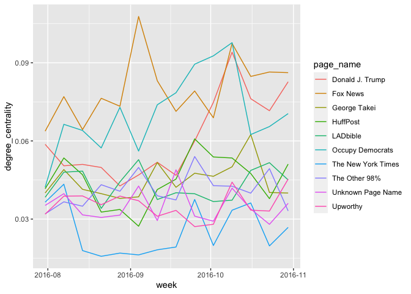
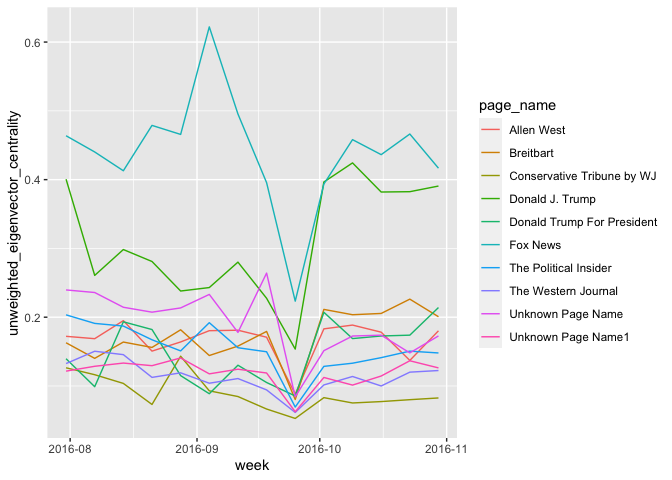
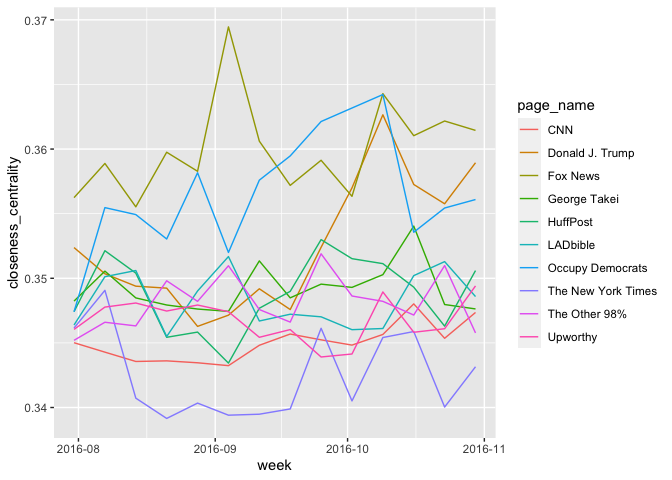
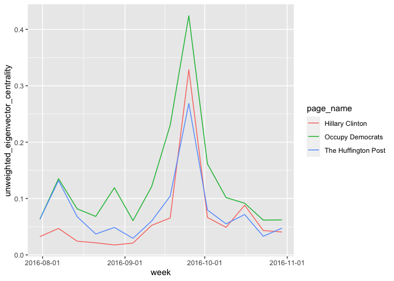
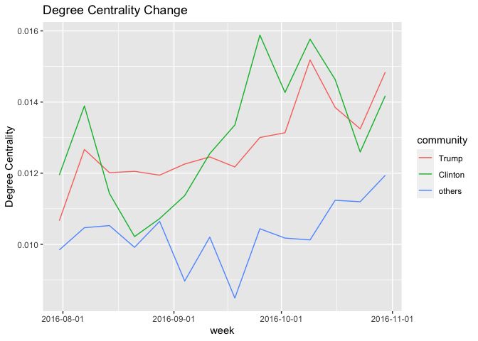
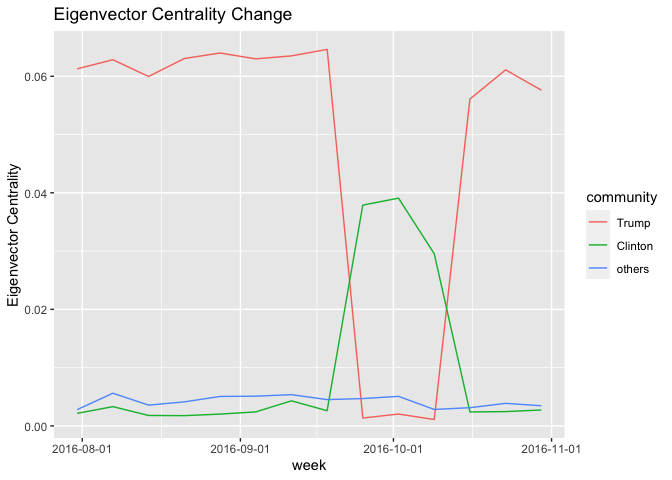
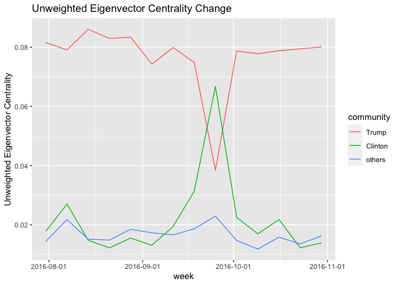
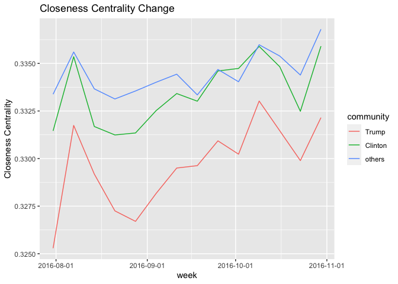

```r
library(readr)
library(tidyverse)
library(scales)
library(plotly)
Full_centrality <- read_csv("Full_centrality.csv", 
    col_types = cols(X1 = col_skip(), 
                     page_id = col_character(), 
                     page_name = col_character(),
                     week = col_date(format = "%Y-%m-%d")))

library(readr)
page_name_map <- read_csv("page_name_map.csv", 
                          col_types = cols(
                            page_id = col_character(), 
                            page_name = col_character()
                          ))


Full_centrality = Full_centrality %>% left_join(page_name_map, by='page_id') %>% select(-X1) %>%relocate(page_name, .after = page_id) 
```

# 不同種類中心性

```r
get_top_10 = function(centrality){
  Full_centrality %>% 
    filter(week == min(week)) %>% 
    arrange(desc(.data[[centrality]])) %>% 
    select(page_name) %>% head(10) %>% pull
}

plot_top_10 = function(top_10_list, centrality){
  top10.centrality.all = Full_centrality %>% filter(page_name %in% top_10_list) %>% select(page_name,.data[[centrality]], week)
  
  (top10.centrality.all %>% ggplot() + 
    geom_line(aes(y = .data[[centrality]], x = week, color=page_name)) +
    scale_x_date(labels = date_format("%Y-%m"))) #%>% ggplotly
}
t10 = get_top_10('degree_centrality')
plot_top_10(t10, 'degree_centrality')
```

<!-- -->
## Degree Centrality
簡而言之就是總觸及率

```r
centrality = 'degree_centrality'
top.10.deg = get_top_10(centrality)
plot_top_10(top.10.deg, centrality)
```

<!-- -->

## Eigenvalue Centrality

與結點互動的對象中心性越高，自己的中心性就會越高

$$
C_E^{user} =  \frac{1}{\lambda} \sum_{p \in page} C_E^{page}(p) a_{ip} \\
C_E^{page} =  \frac{1}{\lambda} \sum_{u \in user} C_E^{user}(u) a_{iu}
$$


```r
centrality = 'eigenvector_centrality'
top.10.eig = get_top_10(centrality)
plot_top_10(top.10.eig, centrality)
```

<!-- -->

```r
centrality = 'unweighted_eigenvector_centrality'
top.10.unw.eig = get_top_10(centrality)
plot_top_10(top.10.unw.eig, centrality)
```

<!-- -->

Narmalize 後容易被 outlire 影響（10月上下，有一個用戶特別勤奮對其中一個粉專按讚，則他與那個粉專的中心性都會增加）


## Closeness Centrality

到其他節點的平均距離（次數）越高，中心性越小。


```r
centrality = 'closeness_centrality'
top.10.cls = get_top_10(centrality)
plot_top_10(top.10.cls, centrality)
```

<!-- -->

互動次數在計算過程中不具意義，較不具代表性的衡量

## Current Flow Betweenness Centrality

如果以其中一個粉專/用戶作為消息來源起點(source)，另外一個粉專/用戶作為消息終點(sink)，則關注的節點對於資訊流量的貢獻有多少？

該節點在每一對節點之間的流量總和，就是Current flow betweenness centrality。

計算上模擬電流運作
https://tinyurl.com/27dcmgj5

## What happned in 2016-09-25?


```r
#out.width="100%"}

top10.unweighted.eig.centrality.week_other = Full_centrality %>% filter(week == '2016-09-25') %>% arrange(desc(unweighted_eigenvector_centrality)) %>% select(page_name) %>% head(3) %>% pull


top10.unweighted.eig.centrality.all = Full_centrality %>% filter(page_name %in% c(top.10.unw.eig[1:3], top10.unweighted.eig.centrality.week_other)) %>% select(page_name,unweighted_eigenvector_centrality, week)


top10.unweighted.eig.centrality.all %>% ggplot() + 
  geom_line(aes(y = unweighted_eigenvector_centrality, x = week, color=page_name)) +
  scale_x_date(labels = date_format("%Y-%m-%d"))
```

<!-- -->

```r
#ggplotly(p)
```

```r
#out.width="100%"}

top10.eig.centrality.week_other = Full_centrality %>% filter(week == '2016-10-02') %>% arrange(desc(eigenvector_centrality)) %>% select(page_name) %>% head(4) %>% pull


top10.eig.centrality.all = Full_centrality %>% filter(page_name %in% c(top.10.eig[1:4], top10.eig.centrality.week_other)) %>% select(page_name,unweighted_eigenvector_centrality, week)


top10.eig.centrality.all %>% ggplot() + 
  geom_line(aes(y = unweighted_eigenvector_centrality, x = week, color=page_name)) +
  scale_x_date(labels = date_format("%Y-%m-%d"))
```

<!-- -->

```r
#ggplotly(p)
```
# 社群偵測 Community Detection

將用戶粉專互動的社會網路投影到只有粉專的社會網路上，並以此進行community detection（透過 Louvain algorithm），可以大致的偵測出支持川普陣營的粉專，以及希拉蕊陣營的粉專。

以下將各個陣營的粉專的各種中心性取平均，畫出隨時間的變化圖


```r
library(readr)
avg_centrality_panel <- read_csv("avg_centrality_panel.csv", 
    col_types = cols(week = col_date(format = "%Y-%m-%d")))
avg_centrality_panel$community = factor(
                      avg_centrality_panel$community,
                      levels = c('Trump', 'Clinton','others'))

plot_avg_centrality = function(col_name, title_name){
  avg_centrality_panel %>% ggplot() +
  geom_line(aes(x = week, y = .data[[col_name]], color = community)) +
  scale_x_date(labels = date_format("%Y-%m-%d")) + 
  ggtitle(paste(title_name, "Change")) +
  ylab(title_name)
}

plot_avg_centrality('degree_centrality', 
                    'Degree Centrality')
```

<!-- -->

```r
plot_avg_centrality('eigenvector_centrality', 
                    'Eigenvector Centrality')
```

<!-- -->

```r
plot_avg_centrality('unweighted_eigenvector_centrality', 
                    'Unweighted Eigenvector Centrality')
```

<!-- -->

```r
plot_avg_centrality('closeness_centrality', 
                    'Closeness Centrality')
```

<!-- -->

# 回歸
將四種不同中心性進行panel data regression
$$
\text{centrality}_{it} = \alpha + \text{fake_count_cum}_{it} \times \beta + \text{is_debate}_{it} \times \gamma + u_i
$$
其中 $\text{is_debate}_t 紀錄了總統大選辯論會的時間，觀察到辯論會時eigenvector centrality有大幅下降，需要把這個因子納入考量，以研究假新聞對中心性的影響。
而\text{fake_count_cum}_{it} 則紀錄了過去累計發布假新聞數量。我假設為線性增加，但centrality實際上會被Normalized，所以可以考慮取對數。

我根據粉專類別(type) 進行迴歸。


1. figure 
例如 Trump 等政治人物或記者

2. group
例如 Occupy Democrats 等政府/非政府組織粉專

3. media
例如 CNN 等媒體。底下又有細分電視、網路、報紙等

4. others
演員、喜劇、歌手等


<style type="text/css">

table{
  width:100%;
  }
</style>

## Degree Centrality

```{=html}
<table border="0" width="*">
<tr><td colspan=9><hr></td></tr>
<tr><td>            </td><td>         (1)              </td><td>         (2)              </td><td>         (3)              </td><td>         (4)              </td><td>         (5)              </td><td>         (6)              </td><td>         (7)              </td><td>         (8)              </td></tr>
<tr><td>            </td><td>      figure              </td><td>       group              </td><td>       media              </td><td>      others              </td><td>      figure              </td><td>       group              </td><td>       media              </td><td>      others              </td></tr>
<tr><td colspan=9><hr></td></tr>
<tr><td>fake_posts_cum</td><td>    0.000522<sup>***</sup></td><td>  0.00000263              </td><td>   0.0000325              </td><td>  -0.0000186              </td><td>    0.000514<sup>***</sup></td><td>  0.00000246              </td><td>   0.0000321              </td><td>  -0.0000186              </td></tr>
<tr><td>            </td><td>      (4.33)              </td><td>      (0.33)              </td><td>      (1.95)              </td><td>     (-0.56)              </td><td>      (4.27)              </td><td>      (0.31)              </td><td>      (1.93)              </td><td>     (-0.56)              </td></tr>
<tr><td colspan=9>&nbsp;</td></tr>
<tr><td>is_debate   </td><td>                          </td><td>                          </td><td>                          </td><td>                          </td><td>    0.000914<sup>**</sup> </td><td>    0.000109              </td><td>    0.000148              </td><td>   -0.000118              </td></tr>
<tr><td>            </td><td>                          </td><td>                          </td><td>                          </td><td>                          </td><td>      (2.89)              </td><td>      (1.02)              </td><td>      (1.71)              </td><td>     (-0.56)              </td></tr>
<tr><td colspan=9>&nbsp;</td></tr>
<tr><td>_cons       </td><td>     0.00524<sup>***</sup></td><td>     0.00269<sup>***</sup></td><td>     0.00388<sup>***</sup></td><td>     0.00300<sup>***</sup></td><td>     0.00517<sup>***</sup></td><td>     0.00268<sup>***</sup></td><td>     0.00387<sup>***</sup></td><td>     0.00301<sup>***</sup></td></tr>
<tr><td>            </td><td>      (6.57)              </td><td>      (6.38)              </td><td>     (13.64)              </td><td>      (3.87)              </td><td>      (6.48)              </td><td>      (6.35)              </td><td>     (13.59)              </td><td>      (3.85)              </td></tr>
<tr><td colspan=9><hr></td></tr>
<tr><td><i>N</i>    </td><td>        1815              </td><td>        2933              </td><td>        7804              </td><td>         567              </td><td>        1815              </td><td>        2933              </td><td>        7804              </td><td>         567              </td></tr>
<tr><td colspan=9><hr></td></tr>
<tr><td colspan=9>
<i>t</i> statistics in parentheses
<br /><sup>*</sup> <i>p</i> < 0.05, <sup>**</sup> <i>p</i> < 0.01, <sup>***</sup> <i>p</i> < 0.001
</td></tr>
</table>
```
## Eigenvector Centrality

```{=html}
<table border="0" width="*">
<tr><td colspan=9><hr></td></tr>
<tr><td>            </td><td>         (1)              </td><td>         (2)              </td><td>         (3)              </td><td>         (4)              </td><td>         (5)              </td><td>         (6)              </td><td>         (7)              </td><td>         (8)              </td></tr>
<tr><td>            </td><td>      figure              </td><td>       group              </td><td>       media              </td><td>      others              </td><td>      figure              </td><td>       group              </td><td>       media              </td><td>      others              </td></tr>
<tr><td colspan=9><hr></td></tr>
<tr><td>fake_posts_cum</td><td>   -0.000371              </td><td>  -0.0000934              </td><td>   -0.000325<sup>*</sup>  </td><td>   0.0000110              </td><td>   -0.000307              </td><td>  -0.0000970              </td><td>   -0.000319<sup>*</sup>  </td><td>   0.0000112              </td></tr>
<tr><td>            </td><td>     (-0.48)              </td><td>     (-0.72)              </td><td>     (-2.46)              </td><td>      (0.17)              </td><td>     (-0.40)              </td><td>     (-0.75)              </td><td>     (-2.42)              </td><td>      (0.18)              </td></tr>
<tr><td colspan=9>&nbsp;</td></tr>
<tr><td>is_debate   </td><td>                          </td><td>                          </td><td>                          </td><td>                          </td><td>    -0.00785<sup>***</sup></td><td>     0.00293              </td><td>    -0.00293<sup>***</sup></td><td>   -0.000619              </td></tr>
<tr><td>            </td><td>                          </td><td>                          </td><td>                          </td><td>                          </td><td>     (-3.77)              </td><td>      (1.46)              </td><td>     (-4.16)              </td><td>     (-1.48)              </td></tr>
<tr><td colspan=9>&nbsp;</td></tr>
<tr><td>_cons       </td><td>      0.0119<sup>***</sup></td><td>     0.00524<sup>***</sup></td><td>     0.00636<sup>***</sup></td><td>     0.00168<sup>**</sup> </td><td>      0.0124<sup>***</sup></td><td>     0.00504<sup>***</sup></td><td>     0.00656<sup>***</sup></td><td>     0.00173<sup>**</sup> </td></tr>
<tr><td>            </td><td>      (3.85)              </td><td>      (4.51)              </td><td>      (5.75)              </td><td>      (3.11)              </td><td>      (4.01)              </td><td>      (4.29)              </td><td>      (5.93)              </td><td>      (3.17)              </td></tr>
<tr><td colspan=9><hr></td></tr>
<tr><td><i>N</i>    </td><td>        1815              </td><td>        2933              </td><td>        7804              </td><td>         567              </td><td>        1815              </td><td>        2933              </td><td>        7804              </td><td>         567              </td></tr>
<tr><td colspan=9><hr></td></tr>
<tr><td colspan=9>
<i>t</i> statistics in parentheses
<br /><sup>*</sup> <i>p</i> < 0.05, <sup>**</sup> <i>p</i> < 0.01, <sup>***</sup> <i>p</i> < 0.001
</td></tr>
</table>
```
## Unweighted-Eigenvector Centrality

```{=html}
<table border="0" width="*">
<tr><td colspan=9><hr></td></tr>
<tr><td>            </td><td>         (1)              </td><td>         (2)              </td><td>         (3)              </td><td>         (4)              </td><td>         (5)              </td><td>         (6)              </td><td>         (7)              </td><td>         (8)              </td></tr>
<tr><td>            </td><td>      figure              </td><td>       group              </td><td>       media              </td><td>      others              </td><td>      figure              </td><td>       group              </td><td>       media              </td><td>      others              </td></tr>
<tr><td colspan=9><hr></td></tr>
<tr><td>fake_posts_cum</td><td>     0.00131<sup>*</sup>  </td><td>   -0.000126<sup>*</sup>  </td><td>   -0.000178<sup>*</sup>  </td><td>  -0.0000498              </td><td>     0.00131<sup>*</sup>  </td><td>   -0.000128<sup>**</sup> </td><td>   -0.000180<sup>*</sup>  </td><td>  -0.0000498              </td></tr>
<tr><td>            </td><td>      (2.31)              </td><td>     (-2.53)              </td><td>     (-2.31)              </td><td>     (-0.47)              </td><td>      (2.31)              </td><td>     (-2.59)              </td><td>     (-2.35)              </td><td>     (-0.47)              </td></tr>
<tr><td colspan=9>&nbsp;</td></tr>
<tr><td>is_debate   </td><td>                          </td><td>                          </td><td>                          </td><td>                          </td><td>   -0.000296              </td><td>     0.00173<sup>*</sup>  </td><td>     0.00112<sup>**</sup> </td><td>    0.000301              </td></tr>
<tr><td>            </td><td>                          </td><td>                          </td><td>                          </td><td>                          </td><td>     (-0.20)              </td><td>      (2.57)              </td><td>      (2.79)              </td><td>      (0.44)              </td></tr>
<tr><td colspan=9>&nbsp;</td></tr>
<tr><td>_cons       </td><td>      0.0210<sup>***</sup></td><td>     0.00967<sup>***</sup></td><td>      0.0124<sup>***</sup></td><td>     0.00582<sup>***</sup></td><td>      0.0210<sup>***</sup></td><td>     0.00955<sup>***</sup></td><td>      0.0123<sup>***</sup></td><td>     0.00580<sup>***</sup></td></tr>
<tr><td>            </td><td>      (6.01)              </td><td>      (8.27)              </td><td>     (10.16)              </td><td>      (4.08)              </td><td>      (5.99)              </td><td>      (8.14)              </td><td>     (10.08)              </td><td>      (4.04)              </td></tr>
<tr><td colspan=9><hr></td></tr>
<tr><td><i>N</i>    </td><td>        1815              </td><td>        2933              </td><td>        7804              </td><td>         567              </td><td>        1815              </td><td>        2933              </td><td>        7804              </td><td>         567              </td></tr>
<tr><td colspan=9><hr></td></tr>
<tr><td colspan=9>
<i>t</i> statistics in parentheses
<br /><sup>*</sup> <i>p</i> < 0.05, <sup>**</sup> <i>p</i> < 0.01, <sup>***</sup> <i>p</i> < 0.001
</td></tr>
</table>
```
## Closeness Centrality

```{=html}
<table border="0" width="*">
<tr><td colspan=9><hr></td></tr>
<tr><td>            </td><td>         (1)              </td><td>         (2)              </td><td>         (3)              </td><td>         (4)              </td><td>         (5)              </td><td>         (6)              </td><td>         (7)              </td><td>         (8)              </td></tr>
<tr><td>            </td><td>      figure              </td><td>       group              </td><td>       media              </td><td>      others              </td><td>      figure              </td><td>       group              </td><td>       media              </td><td>      others              </td></tr>
<tr><td colspan=9><hr></td></tr>
<tr><td>fake_posts_cum</td><td>     0.00163<sup>***</sup></td><td>    0.000318<sup>***</sup></td><td>    0.000204              </td><td>    0.000520              </td><td>     0.00162<sup>***</sup></td><td>    0.000317<sup>***</sup></td><td>    0.000201              </td><td>    0.000519              </td></tr>
<tr><td>            </td><td>      (4.10)              </td><td>      (4.87)              </td><td>      (1.79)              </td><td>      (0.69)              </td><td>      (4.07)              </td><td>      (4.84)              </td><td>      (1.75)              </td><td>      (0.69)              </td></tr>
<tr><td colspan=9>&nbsp;</td></tr>
<tr><td>is_debate   </td><td>                          </td><td>                          </td><td>                          </td><td>                          </td><td>     0.00117              </td><td>    0.000550              </td><td>     0.00154<sup>*</sup>  </td><td>    -0.00628              </td></tr>
<tr><td>            </td><td>                          </td><td>                          </td><td>                          </td><td>                          </td><td>      (1.11)              </td><td>      (0.62)              </td><td>      (2.55)              </td><td>     (-1.13)              </td></tr>
<tr><td colspan=9>&nbsp;</td></tr>
<tr><td>_cons       </td><td>       0.301<sup>***</sup></td><td>       0.297<sup>***</sup></td><td>       0.310<sup>***</sup></td><td>       0.305<sup>***</sup></td><td>       0.301<sup>***</sup></td><td>       0.297<sup>***</sup></td><td>       0.310<sup>***</sup></td><td>       0.305<sup>***</sup></td></tr>
<tr><td>            </td><td>    (126.17)              </td><td>    (184.50)              </td><td>    (291.33)              </td><td>     (87.45)              </td><td>    (125.99)              </td><td>    (186.44)              </td><td>    (291.18)              </td><td>     (86.77)              </td></tr>
<tr><td colspan=9><hr></td></tr>
<tr><td><i>N</i>    </td><td>        1815              </td><td>        2933              </td><td>        7804              </td><td>         567              </td><td>        1815              </td><td>        2933              </td><td>        7804              </td><td>         567              </td></tr>
<tr><td colspan=9><hr></td></tr>
<tr><td colspan=9>
<i>t</i> statistics in parentheses
<br /><sup>*</sup> <i>p</i> < 0.05, <sup>**</sup> <i>p</i> < 0.01, <sup>***</sup> <i>p</i> < 0.001
</td></tr>
</table>
```
