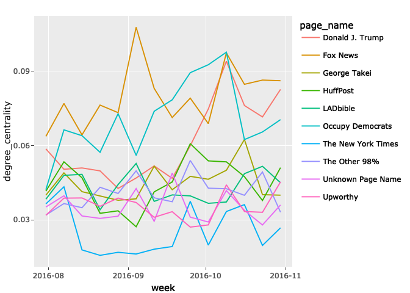
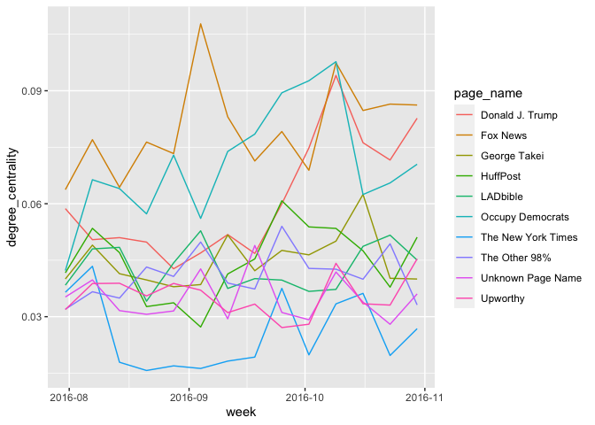
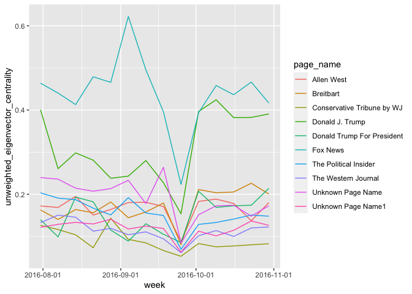
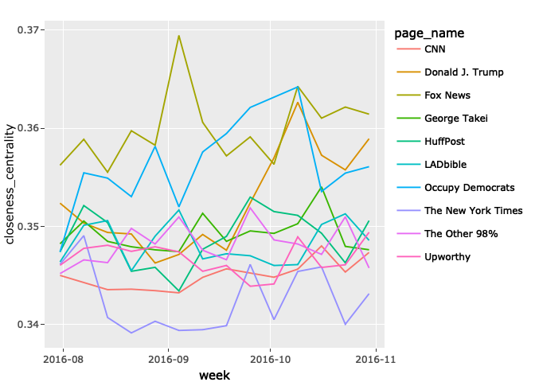
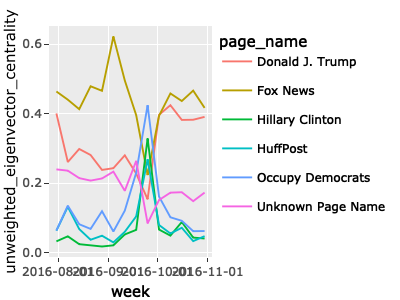
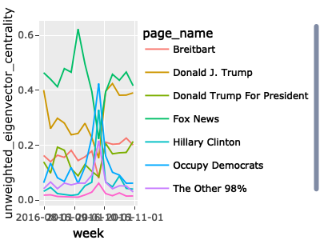
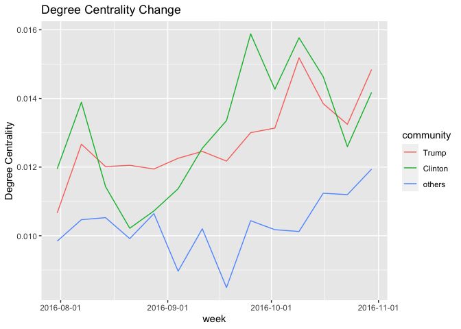
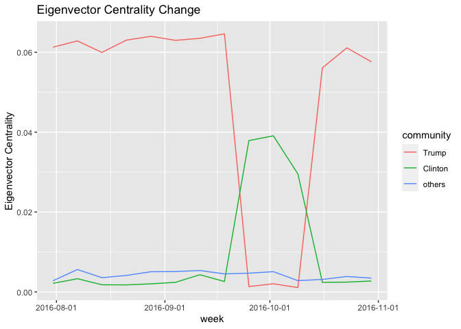

R Notebook
================

``` r
library(readr)
library(tidyverse)
library(scales)
library(plotly)
Full_centrality <- read_csv("Full_centrality.csv", 
    col_types = cols(X1 = col_skip(), 
                     page_id = col_character(), 
                     page_name = col_character(),
                     week = col_date(format = "%Y-%m-%d")))

library(readr)
page_name_map <- read_csv("page_name_map.csv", 
                          col_types = cols(
                            page_id = col_character(), 
                            page_name = col_character()
                          ))


Full_centrality = Full_centrality %>% left_join(page_name_map, by='page_id') %>% select(-X1) %>%relocate(page_name, .after = page_id) 
```

# 不同種類中心性

``` r
get_top_10 = function(centrality){
  Full_centrality %>% 
    filter(week == min(week)) %>% 
    arrange(desc(.data[[centrality]])) %>% 
    select(page_name) %>% head(10) %>% pull
}

plot_top_10 = function(top_10_list, centrality){
  top10.centrality.all = Full_centrality %>% filter(page_name %in% top_10_list) %>% select(page_name,.data[[centrality]], week)
  
  (top10.centrality.all %>% ggplot() + 
    geom_line(aes(y = .data[[centrality]], x = week, color=page_name)) +
    scale_x_date(labels = date_format("%Y-%m"))) #%>% ggplotly
}
t10 = get_top_10('degree_centrality')
plot_top_10(t10, 'degree_centrality')
```

<!-- --> \##
Degree Centrality 簡而言之就是總觸及率

``` r
centrality = 'degree_centrality'
top.10.deg = get_top_10(centrality)
plot_top_10(top.10.deg, centrality)
```

<!-- -->

## Eigenvalue Centrality

與結點互動的對象中心性越高，自己的中心性就會越高

$$
C_E^{user} =  \frac{1}{\lambda} \sum\_{p \in page} C_E^{page}(p) a\_{ip} \\\\
C_E^{page} =  \frac{1}{\lambda} \sum\_{u \in user} C_E^{user}(u) a\_{iu}
$$

``` r
centrality = 'eigenvector_centrality'
top.10.eig = get_top_10(centrality)
plot_top_10(top.10.eig, centrality)
```

<!-- -->

``` r
centrality = 'unweighted_eigenvector_centrality'
top.10.unw.eig = get_top_10(centrality)
plot_top_10(top.10.unw.eig, centrality)
```

<!-- -->

Narmalize 後容易被 outlire
影響（10月上下，有一個用戶特別勤奮對其中一個粉專按讚，則他與那個粉專的中心性都會增加）

## Closeness Centrality

到其他節點的平均距離（次數）越高，中心性越小。

``` r
centrality = 'closeness_centrality'
top.10.cls = get_top_10(centrality)
plot_top_10(top.10.cls, centrality)
```

<!-- -->

互動次數在計算過程中不具意義，較不具代表性的衡量

## Current Flow Betweenness Centrality

如果以其中一個粉專/用戶作為消息來源起點(source)，另外一個粉專/用戶作為消息終點(sink)，則關注的節點對於資訊流量的貢獻有多少？

該節點在每一對節點之間的流量總和，就是Current flow betweenness
centrality。

計算上模擬電流運作 <https://tinyurl.com/27dcmgj5>

## What happned in 2016-09-25?

``` r
#out.width="100%"}

top10.unweighted.eig.centrality.week_other = Full_centrality %>% filter(week == '2016-09-25') %>% arrange(desc(unweighted_eigenvector_centrality)) %>% select(page_name) %>% head(3) %>% pull


top10.unweighted.eig.centrality.all = Full_centrality %>% filter(page_name %in% c(top.10.unw.eig[1:3], top10.unweighted.eig.centrality.week_other)) %>% select(page_name,unweighted_eigenvector_centrality, week)


top10.unweighted.eig.centrality.all %>% ggplot() + 
  geom_line(aes(y = unweighted_eigenvector_centrality, x = week, color=page_name)) +
  scale_x_date(labels = date_format("%Y-%m-%d"))
```

<!-- -->

``` r
#ggplotly(p)
```

``` r
#out.width="100%"}

top10.eig.centrality.week_other = Full_centrality %>% filter(week == '2016-10-02') %>% arrange(desc(eigenvector_centrality)) %>% select(page_name) %>% head(4) %>% pull


top10.eig.centrality.all = Full_centrality %>% filter(page_name %in% c(top.10.eig[1:4], top10.eig.centrality.week_other)) %>% select(page_name,unweighted_eigenvector_centrality, week)


top10.eig.centrality.all %>% ggplot() + 
  geom_line(aes(y = unweighted_eigenvector_centrality, x = week, color=page_name)) +
  scale_x_date(labels = date_format("%Y-%m-%d"))
```

<!-- -->

``` r
#ggplotly(p)
```

# 社群偵測 Community Detection

將用戶粉專互動的社會網路投影到只有粉專的社會網路上，並以此進行community
detection（透過 Louvain
algorithm），可以大致的偵測出支持川普陣營的粉專，以及希拉蕊陣營的粉專。

以下將各個陣營的粉專的各種中心性取平均，畫出隨時間的變化圖

``` r
library(readr)
avg_centrality_panel <- read_csv("avg_centrality_panel.csv", 
    col_types = cols(week = col_date(format = "%Y-%m-%d")))
avg_centrality_panel$community = factor(
                      avg_centrality_panel$community,
                      levels = c('Trump', 'Clinton','others'))

plot_avg_centrality = function(col_name, title_name){
  avg_centrality_panel %>% ggplot() +
  geom_line(aes(x = week, y = .data[[col_name]], color = community)) +
  scale_x_date(labels = date_format("%Y-%m-%d")) + 
  ggtitle(paste(title_name, "Change")) +
  ylab(title_name)
}

plot_avg_centrality('degree_centrality', 
                    'Degree Centrality')
```

<!-- -->

``` r
plot_avg_centrality('eigenvector_centrality', 
                    'Eigenvector Centrality')
```

<!-- -->

``` r
plot_avg_centrality('unweighted_eigenvector_centrality', 
                    'Unweighted Eigenvector Centrality')
```

<!-- -->

``` r
plot_avg_centrality('closeness_centrality', 
                    'Closeness Centrality')
```

<!-- -->
