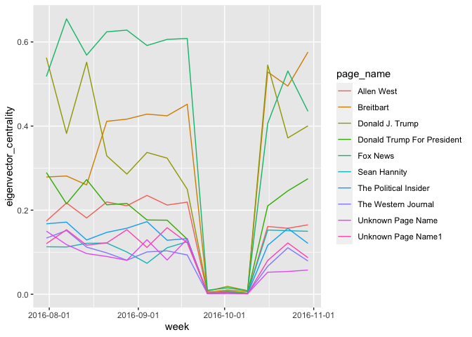
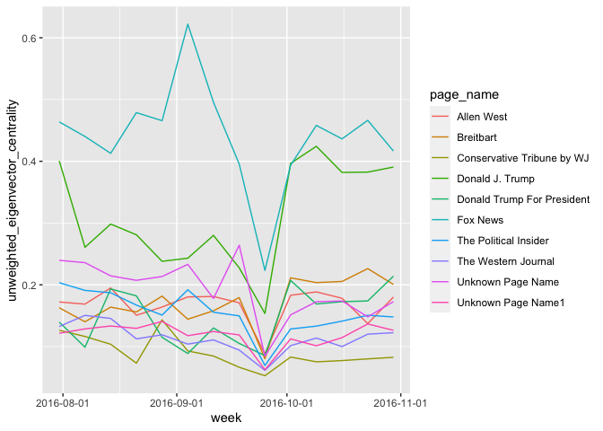
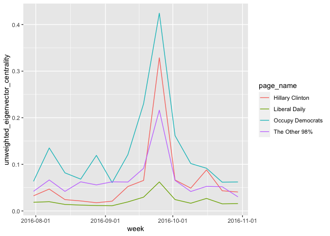

```r
library(readr)
library(tidyverse)
library(scales)
library(plotly)
Full_centrality <- read_csv("Full_centrality.csv", 
    col_types = cols(X1 = col_skip(), 
                     page_id = col_character(), 
                     page_name = col_character(),
                     week = col_date(format = "%Y-%m-%d")))

library(readr)
page_name_map <- read_csv("page_name_map.csv", 
                          col_types = cols(
                            page_id = col_character(), 
                            page_name = col_character()
                          ))


Full_centrality = Full_centrality %>% left_join(page_name_map, by='page_id') %>% select(-X1) %>%relocate(page_name, .after = page_id) 
```

# 不同種類中心性

## Degree Centrality
簡而言之就是總觸及率

```r
week_1 = min(Full_centrality$week)

top10.deg.centrality.week1 = Full_centrality %>% filter(week == week_1) %>% arrange(desc(degree_centrality)) %>% select(page_name) %>% head(10) %>% pull


top10.deg.centrality.all = Full_centrality %>% filter(page_name %in% top10.deg.centrality.week1) %>% select(page_name,degree_centrality, week)


(top10.deg.centrality.all %>% ggplot() + 
  geom_line(aes(y = degree_centrality, x = week, color=page_name)) +
  scale_x_date(labels = date_format("%Y-%m"))) %>% ggplotly
```

```{=html}
<div id="htmlwidget-8aa8abb33de4c905d9b8" style="width:672px;height:480px;" class="plotly html-widget"></div>
<script type="application/json" data-for="htmlwidget-8aa8abb33de4c905d9b8">{"x":{"data":[{"x":[17013,17020,17027,17034,17041,17048,17055,17062,17069,17076,17083,17090,17097,17104],"y":[0.0587,0.05045,0.05099,0.04981,0.04272,0.04693,0.05181,0.0468,0.05997,0.07481,0.09407,0.0762,0.0716,0.0827],"text":["week: 2016-07-31<br />degree_centrality: 0.05870<br />page_name: Donald J. Trump","week: 2016-08-07<br />degree_centrality: 0.05045<br />page_name: Donald J. Trump","week: 2016-08-14<br />degree_centrality: 0.05099<br />page_name: Donald J. Trump","week: 2016-08-21<br />degree_centrality: 0.04981<br />page_name: Donald J. Trump","week: 2016-08-28<br />degree_centrality: 0.04272<br />page_name: Donald J. Trump","week: 2016-09-04<br />degree_centrality: 0.04693<br />page_name: Donald J. Trump","week: 2016-09-11<br />degree_centrality: 0.05181<br />page_name: Donald J. Trump","week: 2016-09-18<br />degree_centrality: 0.04680<br />page_name: Donald J. Trump","week: 2016-09-25<br />degree_centrality: 0.05997<br />page_name: Donald J. Trump","week: 2016-10-02<br />degree_centrality: 0.07481<br />page_name: Donald J. Trump","week: 2016-10-09<br />degree_centrality: 0.09407<br />page_name: Donald J. Trump","week: 2016-10-16<br />degree_centrality: 0.07620<br />page_name: Donald J. Trump","week: 2016-10-23<br />degree_centrality: 0.07160<br />page_name: Donald J. Trump","week: 2016-10-30<br />degree_centrality: 0.08270<br />page_name: Donald J. Trump"],"type":"scatter","mode":"lines","line":{"width":1.88976377952756,"color":"rgba(248,118,109,1)","dash":"solid"},"hoveron":"points","name":"Donald J. Trump","legendgroup":"Donald J. Trump","showlegend":true,"xaxis":"x","yaxis":"y","hoverinfo":"text","frame":null},{"x":[17013,17020,17027,17034,17041,17048,17055,17062,17069,17076,17083,17090,17097,17104],"y":[0.06374,0.077,0.06436,0.07637,0.07332,0.10778,0.08309,0.07135,0.07917,0.06889,0.09744,0.08476,0.08646,0.08621],"text":["week: 2016-07-31<br />degree_centrality: 0.06374<br />page_name: Fox News","week: 2016-08-07<br />degree_centrality: 0.07700<br />page_name: Fox News","week: 2016-08-14<br />degree_centrality: 0.06436<br />page_name: Fox News","week: 2016-08-21<br />degree_centrality: 0.07637<br />page_name: Fox News","week: 2016-08-28<br />degree_centrality: 0.07332<br />page_name: Fox News","week: 2016-09-04<br />degree_centrality: 0.10778<br />page_name: Fox News","week: 2016-09-11<br />degree_centrality: 0.08309<br />page_name: Fox News","week: 2016-09-18<br />degree_centrality: 0.07135<br />page_name: Fox News","week: 2016-09-25<br />degree_centrality: 0.07917<br />page_name: Fox News","week: 2016-10-02<br />degree_centrality: 0.06889<br />page_name: Fox News","week: 2016-10-09<br />degree_centrality: 0.09744<br />page_name: Fox News","week: 2016-10-16<br />degree_centrality: 0.08476<br />page_name: Fox News","week: 2016-10-23<br />degree_centrality: 0.08646<br />page_name: Fox News","week: 2016-10-30<br />degree_centrality: 0.08621<br />page_name: Fox News"],"type":"scatter","mode":"lines","line":{"width":1.88976377952756,"color":"rgba(216,144,0,1)","dash":"solid"},"hoveron":"points","name":"Fox News","legendgroup":"Fox News","showlegend":true,"xaxis":"x","yaxis":"y","hoverinfo":"text","frame":null},{"x":[17013,17020,17027,17034,17041,17048,17055,17062,17069,17076,17083,17090,17097,17104],"y":[0.04002,0.049,0.04142,0.03976,0.03795,0.03853,0.0517,0.0422,0.0476,0.04642,0.05006,0.06247,0.0402,0.04],"text":["week: 2016-07-31<br />degree_centrality: 0.04002<br />page_name: George Takei","week: 2016-08-07<br />degree_centrality: 0.04900<br />page_name: George Takei","week: 2016-08-14<br />degree_centrality: 0.04142<br />page_name: George Takei","week: 2016-08-21<br />degree_centrality: 0.03976<br />page_name: George Takei","week: 2016-08-28<br />degree_centrality: 0.03795<br />page_name: George Takei","week: 2016-09-04<br />degree_centrality: 0.03853<br />page_name: George Takei","week: 2016-09-11<br />degree_centrality: 0.05170<br />page_name: George Takei","week: 2016-09-18<br />degree_centrality: 0.04220<br />page_name: George Takei","week: 2016-09-25<br />degree_centrality: 0.04760<br />page_name: George Takei","week: 2016-10-02<br />degree_centrality: 0.04642<br />page_name: George Takei","week: 2016-10-09<br />degree_centrality: 0.05006<br />page_name: George Takei","week: 2016-10-16<br />degree_centrality: 0.06247<br />page_name: George Takei","week: 2016-10-23<br />degree_centrality: 0.04020<br />page_name: George Takei","week: 2016-10-30<br />degree_centrality: 0.04000<br />page_name: George Takei"],"type":"scatter","mode":"lines","line":{"width":1.88976377952756,"color":"rgba(163,165,0,1)","dash":"solid"},"hoveron":"points","name":"George Takei","legendgroup":"George Takei","showlegend":true,"xaxis":"x","yaxis":"y","hoverinfo":"text","frame":null},{"x":[17013,17020,17027,17034,17041,17048,17055,17062,17069,17076,17083,17090,17097,17104],"y":[0.04164,0.05346,0.04702,0.03268,0.03369,0.02726,0.04134,0.04533,0.06078,0.05384,0.05345,0.0475,0.03785,0.05111],"text":["week: 2016-07-31<br />degree_centrality: 0.04164<br />page_name: HuffPost","week: 2016-08-07<br />degree_centrality: 0.05346<br />page_name: HuffPost","week: 2016-08-14<br />degree_centrality: 0.04702<br />page_name: HuffPost","week: 2016-08-21<br />degree_centrality: 0.03268<br />page_name: HuffPost","week: 2016-08-28<br />degree_centrality: 0.03369<br />page_name: HuffPost","week: 2016-09-04<br />degree_centrality: 0.02726<br />page_name: HuffPost","week: 2016-09-11<br />degree_centrality: 0.04134<br />page_name: HuffPost","week: 2016-09-18<br />degree_centrality: 0.04533<br />page_name: HuffPost","week: 2016-09-25<br />degree_centrality: 0.06078<br />page_name: HuffPost","week: 2016-10-02<br />degree_centrality: 0.05384<br />page_name: HuffPost","week: 2016-10-09<br />degree_centrality: 0.05345<br />page_name: HuffPost","week: 2016-10-16<br />degree_centrality: 0.04750<br />page_name: HuffPost","week: 2016-10-23<br />degree_centrality: 0.03785<br />page_name: HuffPost","week: 2016-10-30<br />degree_centrality: 0.05111<br />page_name: HuffPost"],"type":"scatter","mode":"lines","line":{"width":1.88976377952756,"color":"rgba(57,182,0,1)","dash":"solid"},"hoveron":"points","name":"HuffPost","legendgroup":"HuffPost","showlegend":true,"xaxis":"x","yaxis":"y","hoverinfo":"text","frame":null},{"x":[17013,17020,17027,17034,17041,17048,17055,17062,17069,17076,17083,17090,17097,17104],"y":[0.03837,0.048,0.04841,0.03411,0.04428,0.0528,0.0375,0.04011,0.03972,0.03672,0.03725,0.04868,0.05165,0.04503],"text":["week: 2016-07-31<br />degree_centrality: 0.03837<br />page_name: LADbible","week: 2016-08-07<br />degree_centrality: 0.04800<br />page_name: LADbible","week: 2016-08-14<br />degree_centrality: 0.04841<br />page_name: LADbible","week: 2016-08-21<br />degree_centrality: 0.03411<br />page_name: LADbible","week: 2016-08-28<br />degree_centrality: 0.04428<br />page_name: LADbible","week: 2016-09-04<br />degree_centrality: 0.05280<br />page_name: LADbible","week: 2016-09-11<br />degree_centrality: 0.03750<br />page_name: LADbible","week: 2016-09-18<br />degree_centrality: 0.04011<br />page_name: LADbible","week: 2016-09-25<br />degree_centrality: 0.03972<br />page_name: LADbible","week: 2016-10-02<br />degree_centrality: 0.03672<br />page_name: LADbible","week: 2016-10-09<br />degree_centrality: 0.03725<br />page_name: LADbible","week: 2016-10-16<br />degree_centrality: 0.04868<br />page_name: LADbible","week: 2016-10-23<br />degree_centrality: 0.05165<br />page_name: LADbible","week: 2016-10-30<br />degree_centrality: 0.04503<br />page_name: LADbible"],"type":"scatter","mode":"lines","line":{"width":1.88976377952756,"color":"rgba(0,191,125,1)","dash":"solid"},"hoveron":"points","name":"LADbible","legendgroup":"LADbible","showlegend":true,"xaxis":"x","yaxis":"y","hoverinfo":"text","frame":null},{"x":[17013,17020,17027,17034,17041,17048,17055,17062,17069,17076,17083,17090,17097,17104],"y":[0.04224,0.06637,0.06402,0.05731,0.07291,0.0561,0.07388,0.07849,0.08946,0.09266,0.09772,0.06244,0.06552,0.07049],"text":["week: 2016-07-31<br />degree_centrality: 0.04224<br />page_name: Occupy Democrats","week: 2016-08-07<br />degree_centrality: 0.06637<br />page_name: Occupy Democrats","week: 2016-08-14<br />degree_centrality: 0.06402<br />page_name: Occupy Democrats","week: 2016-08-21<br />degree_centrality: 0.05731<br />page_name: Occupy Democrats","week: 2016-08-28<br />degree_centrality: 0.07291<br />page_name: Occupy Democrats","week: 2016-09-04<br />degree_centrality: 0.05610<br />page_name: Occupy Democrats","week: 2016-09-11<br />degree_centrality: 0.07388<br />page_name: Occupy Democrats","week: 2016-09-18<br />degree_centrality: 0.07849<br />page_name: Occupy Democrats","week: 2016-09-25<br />degree_centrality: 0.08946<br />page_name: Occupy Democrats","week: 2016-10-02<br />degree_centrality: 0.09266<br />page_name: Occupy Democrats","week: 2016-10-09<br />degree_centrality: 0.09772<br />page_name: Occupy Democrats","week: 2016-10-16<br />degree_centrality: 0.06244<br />page_name: Occupy Democrats","week: 2016-10-23<br />degree_centrality: 0.06552<br />page_name: Occupy Democrats","week: 2016-10-30<br />degree_centrality: 0.07049<br />page_name: Occupy Democrats"],"type":"scatter","mode":"lines","line":{"width":1.88976377952756,"color":"rgba(0,191,196,1)","dash":"solid"},"hoveron":"points","name":"Occupy Democrats","legendgroup":"Occupy Democrats","showlegend":true,"xaxis":"x","yaxis":"y","hoverinfo":"text","frame":null},{"x":[17013,17020,17027,17034,17041,17048,17055,17062,17069,17076,17083,17090,17097,17104],"y":[0.03649,0.04338,0.0179,0.01571,0.01694,0.01625,0.0182,0.01927,0.03752,0.01986,0.0334,0.03619,0.0197,0.02682],"text":["week: 2016-07-31<br />degree_centrality: 0.03649<br />page_name: The New York Times","week: 2016-08-07<br />degree_centrality: 0.04338<br />page_name: The New York Times","week: 2016-08-14<br />degree_centrality: 0.01790<br />page_name: The New York Times","week: 2016-08-21<br />degree_centrality: 0.01571<br />page_name: The New York Times","week: 2016-08-28<br />degree_centrality: 0.01694<br />page_name: The New York Times","week: 2016-09-04<br />degree_centrality: 0.01625<br />page_name: The New York Times","week: 2016-09-11<br />degree_centrality: 0.01820<br />page_name: The New York Times","week: 2016-09-18<br />degree_centrality: 0.01927<br />page_name: The New York Times","week: 2016-09-25<br />degree_centrality: 0.03752<br />page_name: The New York Times","week: 2016-10-02<br />degree_centrality: 0.01986<br />page_name: The New York Times","week: 2016-10-09<br />degree_centrality: 0.03340<br />page_name: The New York Times","week: 2016-10-16<br />degree_centrality: 0.03619<br />page_name: The New York Times","week: 2016-10-23<br />degree_centrality: 0.01970<br />page_name: The New York Times","week: 2016-10-30<br />degree_centrality: 0.02682<br />page_name: The New York Times"],"type":"scatter","mode":"lines","line":{"width":1.88976377952756,"color":"rgba(0,176,246,1)","dash":"solid"},"hoveron":"points","name":"The New York Times","legendgroup":"The New York Times","showlegend":true,"xaxis":"x","yaxis":"y","hoverinfo":"text","frame":null},{"x":[17013,17020,17027,17034,17041,17048,17055,17062,17069,17076,17083,17090,17097,17104],"y":[0.03199,0.03662,0.03494,0.04319,0.04069,0.04982,0.03894,0.03735,0.054,0.04282,0.04261,0.03995,0.04936,0.03313],"text":["week: 2016-07-31<br />degree_centrality: 0.03199<br />page_name: The Other 98%","week: 2016-08-07<br />degree_centrality: 0.03662<br />page_name: The Other 98%","week: 2016-08-14<br />degree_centrality: 0.03494<br />page_name: The Other 98%","week: 2016-08-21<br />degree_centrality: 0.04319<br />page_name: The Other 98%","week: 2016-08-28<br />degree_centrality: 0.04069<br />page_name: The Other 98%","week: 2016-09-04<br />degree_centrality: 0.04982<br />page_name: The Other 98%","week: 2016-09-11<br />degree_centrality: 0.03894<br />page_name: The Other 98%","week: 2016-09-18<br />degree_centrality: 0.03735<br />page_name: The Other 98%","week: 2016-09-25<br />degree_centrality: 0.05400<br />page_name: The Other 98%","week: 2016-10-02<br />degree_centrality: 0.04282<br />page_name: The Other 98%","week: 2016-10-09<br />degree_centrality: 0.04261<br />page_name: The Other 98%","week: 2016-10-16<br />degree_centrality: 0.03995<br />page_name: The Other 98%","week: 2016-10-23<br />degree_centrality: 0.04936<br />page_name: The Other 98%","week: 2016-10-30<br />degree_centrality: 0.03313<br />page_name: The Other 98%"],"type":"scatter","mode":"lines","line":{"width":1.88976377952756,"color":"rgba(149,144,255,1)","dash":"solid"},"hoveron":"points","name":"The Other 98%","legendgroup":"The Other 98%","showlegend":true,"xaxis":"x","yaxis":"y","hoverinfo":"text","frame":null},{"x":[17013,17020,17027,17034,17041,17048,17055,17062,17069,17076,17083,17090,17097,17104],"y":[0.03523,0.03976,0.03161,0.03063,0.03152,0.04268,0.02943,0.04891,0.03112,0.02918,0.04186,0.03388,0.02798,0.03605],"text":["week: 2016-07-31<br />degree_centrality: 0.03523<br />page_name: Unknown Page Name","week: 2016-08-07<br />degree_centrality: 0.03976<br />page_name: Unknown Page Name","week: 2016-08-14<br />degree_centrality: 0.03161<br />page_name: Unknown Page Name","week: 2016-08-21<br />degree_centrality: 0.03063<br />page_name: Unknown Page Name","week: 2016-08-28<br />degree_centrality: 0.03152<br />page_name: Unknown Page Name","week: 2016-09-04<br />degree_centrality: 0.04268<br />page_name: Unknown Page Name","week: 2016-09-11<br />degree_centrality: 0.02943<br />page_name: Unknown Page Name","week: 2016-09-18<br />degree_centrality: 0.04891<br />page_name: Unknown Page Name","week: 2016-09-25<br />degree_centrality: 0.03112<br />page_name: Unknown Page Name","week: 2016-10-02<br />degree_centrality: 0.02918<br />page_name: Unknown Page Name","week: 2016-10-09<br />degree_centrality: 0.04186<br />page_name: Unknown Page Name","week: 2016-10-16<br />degree_centrality: 0.03388<br />page_name: Unknown Page Name","week: 2016-10-23<br />degree_centrality: 0.02798<br />page_name: Unknown Page Name","week: 2016-10-30<br />degree_centrality: 0.03605<br />page_name: Unknown Page Name"],"type":"scatter","mode":"lines","line":{"width":1.88976377952756,"color":"rgba(231,107,243,1)","dash":"solid"},"hoveron":"points","name":"Unknown Page Name","legendgroup":"Unknown Page Name","showlegend":true,"xaxis":"x","yaxis":"y","hoverinfo":"text","frame":null},{"x":[17013,17020,17027,17034,17041,17048,17055,17062,17069,17076,17083,17090,17097,17104],"y":[0.03189,0.0388,0.03888,0.03552,0.03883,0.03704,0.03108,0.03334,0.02711,0.028,0.04417,0.03343,0.03308,0.04535],"text":["week: 2016-07-31<br />degree_centrality: 0.03189<br />page_name: Upworthy","week: 2016-08-07<br />degree_centrality: 0.03880<br />page_name: Upworthy","week: 2016-08-14<br />degree_centrality: 0.03888<br />page_name: Upworthy","week: 2016-08-21<br />degree_centrality: 0.03552<br />page_name: Upworthy","week: 2016-08-28<br />degree_centrality: 0.03883<br />page_name: Upworthy","week: 2016-09-04<br />degree_centrality: 0.03704<br />page_name: Upworthy","week: 2016-09-11<br />degree_centrality: 0.03108<br />page_name: Upworthy","week: 2016-09-18<br />degree_centrality: 0.03334<br />page_name: Upworthy","week: 2016-09-25<br />degree_centrality: 0.02711<br />page_name: Upworthy","week: 2016-10-02<br />degree_centrality: 0.02800<br />page_name: Upworthy","week: 2016-10-09<br />degree_centrality: 0.04417<br />page_name: Upworthy","week: 2016-10-16<br />degree_centrality: 0.03343<br />page_name: Upworthy","week: 2016-10-23<br />degree_centrality: 0.03308<br />page_name: Upworthy","week: 2016-10-30<br />degree_centrality: 0.04535<br />page_name: Upworthy"],"type":"scatter","mode":"lines","line":{"width":1.88976377952756,"color":"rgba(255,98,188,1)","dash":"solid"},"hoveron":"points","name":"Upworthy","legendgroup":"Upworthy","showlegend":true,"xaxis":"x","yaxis":"y","hoverinfo":"text","frame":null}],"layout":{"margin":{"t":26.2283105022831,"r":7.30593607305936,"b":40.1826484018265,"l":48.9497716894977},"plot_bgcolor":"rgba(235,235,235,1)","paper_bgcolor":"rgba(255,255,255,1)","font":{"color":"rgba(0,0,0,1)","family":"","size":14.6118721461187},"xaxis":{"domain":[0,1],"automargin":true,"type":"linear","autorange":false,"range":[17008.45,17108.55],"tickmode":"array","ticktext":["2016-08","2016-09","2016-10","2016-11"],"tickvals":[17014,17045,17075,17106],"categoryorder":"array","categoryarray":["2016-08","2016-09","2016-10","2016-11"],"nticks":null,"ticks":"outside","tickcolor":"rgba(51,51,51,1)","ticklen":3.65296803652968,"tickwidth":0.66417600664176,"showticklabels":true,"tickfont":{"color":"rgba(77,77,77,1)","family":"","size":11.689497716895},"tickangle":-0,"showline":false,"linecolor":null,"linewidth":0,"showgrid":true,"gridcolor":"rgba(255,255,255,1)","gridwidth":0.66417600664176,"zeroline":false,"anchor":"y","title":{"text":"week","font":{"color":"rgba(0,0,0,1)","family":"","size":14.6118721461187}},"hoverformat":".2f"},"yaxis":{"domain":[0,1],"automargin":true,"type":"linear","autorange":false,"range":[0.0111065,0.1123835],"tickmode":"array","ticktext":["0.03","0.06","0.09"],"tickvals":[0.03,0.06,0.09],"categoryorder":"array","categoryarray":["0.03","0.06","0.09"],"nticks":null,"ticks":"outside","tickcolor":"rgba(51,51,51,1)","ticklen":3.65296803652968,"tickwidth":0.66417600664176,"showticklabels":true,"tickfont":{"color":"rgba(77,77,77,1)","family":"","size":11.689497716895},"tickangle":-0,"showline":false,"linecolor":null,"linewidth":0,"showgrid":true,"gridcolor":"rgba(255,255,255,1)","gridwidth":0.66417600664176,"zeroline":false,"anchor":"x","title":{"text":"degree_centrality","font":{"color":"rgba(0,0,0,1)","family":"","size":14.6118721461187}},"hoverformat":".2f"},"shapes":[{"type":"rect","fillcolor":null,"line":{"color":null,"width":0,"linetype":[]},"yref":"paper","xref":"paper","x0":0,"x1":1,"y0":0,"y1":1}],"showlegend":true,"legend":{"bgcolor":"rgba(255,255,255,1)","bordercolor":"transparent","borderwidth":1.88976377952756,"font":{"color":"rgba(0,0,0,1)","family":"","size":11.689497716895},"title":{"text":"page_name","font":{"color":"rgba(0,0,0,1)","family":"","size":14.6118721461187}}},"hovermode":"closest","barmode":"relative"},"config":{"doubleClick":"reset","modeBarButtonsToAdd":["hoverclosest","hovercompare"],"showSendToCloud":false},"source":"A","attrs":{"a8d75d1a25f":{"x":{},"y":{},"colour":{},"type":"scatter"}},"cur_data":"a8d75d1a25f","visdat":{"a8d75d1a25f":["function (y) ","x"]},"highlight":{"on":"plotly_click","persistent":false,"dynamic":false,"selectize":false,"opacityDim":0.2,"selected":{"opacity":1},"debounce":0},"shinyEvents":["plotly_hover","plotly_click","plotly_selected","plotly_relayout","plotly_brushed","plotly_brushing","plotly_clickannotation","plotly_doubleclick","plotly_deselect","plotly_afterplot","plotly_sunburstclick"],"base_url":"https://plot.ly"},"evals":[],"jsHooks":[]}</script>
```

## Eigenvalue Centrality

與結點互動的對象中心性越高，自己的中心性就會越高

$$
C_E^{user} =  \frac{1}{\lambda} \sum_{p \in page} C_E^{page}(p) a_{ip} \\
C_E^{page} =  \frac{1}{\lambda} \sum_{u \in user} C_E^{user}(u) a_{iu}
$$


```r
top10.eig.centrality.week1 = Full_centrality %>% filter(week == week_1) %>% arrange(desc(eigenvector_centrality)) %>% select(page_name) %>% head(10) %>% pull


top10.eig.centrality.all = Full_centrality %>% filter(page_name %in% top10.eig.centrality.week1) %>% select(page_name,eigenvector_centrality, week)


top10.eig.centrality.all %>% ggplot() + 
  geom_line(aes(y = eigenvector_centrality, x = week, color=page_name)) +
  scale_x_date(labels = date_format("%Y-%m-%d"))
```

<!-- -->

```r
top10.unweighted.eig.centrality.week1 = Full_centrality %>% filter(week == week_1) %>% arrange(desc(unweighted_eigenvector_centrality)) %>% select(page_name) %>% head(10) %>% pull


top10.unweighted.eig.centrality.all = Full_centrality %>% filter(page_name %in% top10.unweighted.eig.centrality.week1) %>% select(page_name,unweighted_eigenvector_centrality, week)


top10.unweighted.eig.centrality.all %>% ggplot() + 
  geom_line(aes(y = unweighted_eigenvector_centrality, x = week, color=page_name)) +
  scale_x_date(labels = date_format("%Y-%m-%d"))
```

<!-- -->

Narmalize 後容易被 outlire 影響（10月上下，有一個用戶特別勤奮對其中一個粉專按讚，則他與那個粉專的中心性都會增加）


## Closeness Centrality

到其他節點的平均距離（次數）越高，中心性越小。


```r
top10.cls.centrality.week1 = Full_centrality %>% filter(week == week_1) %>% arrange(desc(closeness_centrality)) %>% select(page_name) %>% head(10) %>% pull


top10.cls.centrality.all = Full_centrality %>% filter(page_name %in% top10.cls.centrality.week1) %>% select(page_name,closeness_centrality, week)


(top10.cls.centrality.all %>% ggplot() + 
  geom_line(aes(y = closeness_centrality, x = week, color=page_name)) +
  scale_x_date(labels = date_format("%Y-%m"))) %>% ggplotly
```

```{=html}
<div id="htmlwidget-d5d126299d1b49913752" style="width:672px;height:480px;" class="plotly html-widget"></div>
<script type="application/json" data-for="htmlwidget-d5d126299d1b49913752">{"x":{"data":[{"x":[17013,17020,17027,17034,17041,17048,17055,17062,17069,17076,17083,17090,17097,17104],"y":[0.345013904134273,0.344284540229159,0.343563052707301,0.343610097696331,0.34346122367396,0.343239345432268,0.344815898507534,0.345686068898209,0.345237871569357,0.344828854982311,0.345653333174172,0.348018925575885,0.345356521473051,0.347355799246466],"text":["week: 2016-07-31<br />closeness_centrality: 0.3450139<br />page_name: CNN","week: 2016-08-07<br />closeness_centrality: 0.3442845<br />page_name: CNN","week: 2016-08-14<br />closeness_centrality: 0.3435631<br />page_name: CNN","week: 2016-08-21<br />closeness_centrality: 0.3436101<br />page_name: CNN","week: 2016-08-28<br />closeness_centrality: 0.3434612<br />page_name: CNN","week: 2016-09-04<br />closeness_centrality: 0.3432393<br />page_name: CNN","week: 2016-09-11<br />closeness_centrality: 0.3448159<br />page_name: CNN","week: 2016-09-18<br />closeness_centrality: 0.3456861<br />page_name: CNN","week: 2016-09-25<br />closeness_centrality: 0.3452379<br />page_name: CNN","week: 2016-10-02<br />closeness_centrality: 0.3448289<br />page_name: CNN","week: 2016-10-09<br />closeness_centrality: 0.3456533<br />page_name: CNN","week: 2016-10-16<br />closeness_centrality: 0.3480189<br />page_name: CNN","week: 2016-10-23<br />closeness_centrality: 0.3453565<br />page_name: CNN","week: 2016-10-30<br />closeness_centrality: 0.3473558<br />page_name: CNN"],"type":"scatter","mode":"lines","line":{"width":1.88976377952756,"color":"rgba(248,118,109,1)","dash":"solid"},"hoveron":"points","name":"CNN","legendgroup":"CNN","showlegend":true,"xaxis":"x","yaxis":"y","hoverinfo":"text","frame":null},{"x":[17013,17020,17027,17034,17041,17048,17055,17062,17069,17076,17083,17090,17097,17104],"y":[0.352376842607483,0.350348599333041,0.349389763563935,0.349237173739184,0.346277841148419,0.347146097716366,0.349186776550618,0.347581116098157,0.352398633938668,0.356994938210309,0.362650586556968,0.357260836826627,0.355765993424915,0.35894086951808],"text":["week: 2016-07-31<br />closeness_centrality: 0.3523768<br />page_name: Donald J. Trump","week: 2016-08-07<br />closeness_centrality: 0.3503486<br />page_name: Donald J. Trump","week: 2016-08-14<br />closeness_centrality: 0.3493898<br />page_name: Donald J. Trump","week: 2016-08-21<br />closeness_centrality: 0.3492372<br />page_name: Donald J. Trump","week: 2016-08-28<br />closeness_centrality: 0.3462778<br />page_name: Donald J. Trump","week: 2016-09-04<br />closeness_centrality: 0.3471461<br />page_name: Donald J. Trump","week: 2016-09-11<br />closeness_centrality: 0.3491868<br />page_name: Donald J. Trump","week: 2016-09-18<br />closeness_centrality: 0.3475811<br />page_name: Donald J. Trump","week: 2016-09-25<br />closeness_centrality: 0.3523986<br />page_name: Donald J. Trump","week: 2016-10-02<br />closeness_centrality: 0.3569949<br />page_name: Donald J. Trump","week: 2016-10-09<br />closeness_centrality: 0.3626506<br />page_name: Donald J. Trump","week: 2016-10-16<br />closeness_centrality: 0.3572608<br />page_name: Donald J. Trump","week: 2016-10-23<br />closeness_centrality: 0.3557660<br />page_name: Donald J. Trump","week: 2016-10-30<br />closeness_centrality: 0.3589409<br />page_name: Donald J. Trump"],"type":"scatter","mode":"lines","line":{"width":1.88976377952756,"color":"rgba(216,144,0,1)","dash":"solid"},"hoveron":"points","name":"Donald J. Trump","legendgroup":"Donald J. Trump","showlegend":true,"xaxis":"x","yaxis":"y","hoverinfo":"text","frame":null},{"x":[17013,17020,17027,17034,17041,17048,17055,17062,17069,17076,17083,17090,17097,17104],"y":[0.356241257293839,0.358885523140082,0.355531109365692,0.359754806192606,0.358280544504488,0.369455085106776,0.360610078878951,0.357190210640192,0.359132634217724,0.356343323489618,0.36428751159719,0.361034979070881,0.362171268787572,0.361445417958117],"text":["week: 2016-07-31<br />closeness_centrality: 0.3562413<br />page_name: Fox News","week: 2016-08-07<br />closeness_centrality: 0.3588855<br />page_name: Fox News","week: 2016-08-14<br />closeness_centrality: 0.3555311<br />page_name: Fox News","week: 2016-08-21<br />closeness_centrality: 0.3597548<br />page_name: Fox News","week: 2016-08-28<br />closeness_centrality: 0.3582805<br />page_name: Fox News","week: 2016-09-04<br />closeness_centrality: 0.3694551<br />page_name: Fox News","week: 2016-09-11<br />closeness_centrality: 0.3606101<br />page_name: Fox News","week: 2016-09-18<br />closeness_centrality: 0.3571902<br />page_name: Fox News","week: 2016-09-25<br />closeness_centrality: 0.3591326<br />page_name: Fox News","week: 2016-10-02<br />closeness_centrality: 0.3563433<br />page_name: Fox News","week: 2016-10-09<br />closeness_centrality: 0.3642875<br />page_name: Fox News","week: 2016-10-16<br />closeness_centrality: 0.3610350<br />page_name: Fox News","week: 2016-10-23<br />closeness_centrality: 0.3621713<br />page_name: Fox News","week: 2016-10-30<br />closeness_centrality: 0.3614454<br />page_name: Fox News"],"type":"scatter","mode":"lines","line":{"width":1.88976377952756,"color":"rgba(163,165,0,1)","dash":"solid"},"hoveron":"points","name":"Fox News","legendgroup":"Fox News","showlegend":true,"xaxis":"x","yaxis":"y","hoverinfo":"text","frame":null},{"x":[17013,17020,17027,17034,17041,17048,17055,17062,17069,17076,17083,17090,17097,17104],"y":[0.348235099579984,0.350554029775476,0.348481650713736,0.347933447403274,0.347619872998252,0.347439881698105,0.351343417321145,0.348486342182853,0.349547230800755,0.349295531914251,0.350279893498138,0.354038040926966,0.347969812962661,0.34762858310328],"text":["week: 2016-07-31<br />closeness_centrality: 0.3482351<br />page_name: George Takei","week: 2016-08-07<br />closeness_centrality: 0.3505540<br />page_name: George Takei","week: 2016-08-14<br />closeness_centrality: 0.3484817<br />page_name: George Takei","week: 2016-08-21<br />closeness_centrality: 0.3479334<br />page_name: George Takei","week: 2016-08-28<br />closeness_centrality: 0.3476199<br />page_name: George Takei","week: 2016-09-04<br />closeness_centrality: 0.3474399<br />page_name: George Takei","week: 2016-09-11<br />closeness_centrality: 0.3513434<br />page_name: George Takei","week: 2016-09-18<br />closeness_centrality: 0.3484863<br />page_name: George Takei","week: 2016-09-25<br />closeness_centrality: 0.3495472<br />page_name: George Takei","week: 2016-10-02<br />closeness_centrality: 0.3492955<br />page_name: George Takei","week: 2016-10-09<br />closeness_centrality: 0.3502799<br />page_name: George Takei","week: 2016-10-16<br />closeness_centrality: 0.3540380<br />page_name: George Takei","week: 2016-10-23<br />closeness_centrality: 0.3479698<br />page_name: George Takei","week: 2016-10-30<br />closeness_centrality: 0.3476286<br />page_name: George Takei"],"type":"scatter","mode":"lines","line":{"width":1.88976377952756,"color":"rgba(57,182,0,1)","dash":"solid"},"hoveron":"points","name":"George Takei","legendgroup":"George Takei","showlegend":true,"xaxis":"x","yaxis":"y","hoverinfo":"text","frame":null},{"x":[17013,17020,17027,17034,17041,17048,17055,17062,17069,17076,17083,17090,17097,17104],"y":[0.347416585599207,0.352133141280649,0.350401030533193,0.345433523375974,0.345835702016796,0.343436395871695,0.347681807731843,0.348988095538692,0.352992818591448,0.35151812374838,0.351133664932979,0.349314208801773,0.346297631871217,0.350596011906941],"text":["week: 2016-07-31<br />closeness_centrality: 0.3474166<br />page_name: HuffPost","week: 2016-08-07<br />closeness_centrality: 0.3521331<br />page_name: HuffPost","week: 2016-08-14<br />closeness_centrality: 0.3504010<br />page_name: HuffPost","week: 2016-08-21<br />closeness_centrality: 0.3454335<br />page_name: HuffPost","week: 2016-08-28<br />closeness_centrality: 0.3458357<br />page_name: HuffPost","week: 2016-09-04<br />closeness_centrality: 0.3434364<br />page_name: HuffPost","week: 2016-09-11<br />closeness_centrality: 0.3476818<br />page_name: HuffPost","week: 2016-09-18<br />closeness_centrality: 0.3489881<br />page_name: HuffPost","week: 2016-09-25<br />closeness_centrality: 0.3529928<br />page_name: HuffPost","week: 2016-10-02<br />closeness_centrality: 0.3515181<br />page_name: HuffPost","week: 2016-10-09<br />closeness_centrality: 0.3511337<br />page_name: HuffPost","week: 2016-10-16<br />closeness_centrality: 0.3493142<br />page_name: HuffPost","week: 2016-10-23<br />closeness_centrality: 0.3462976<br />page_name: HuffPost","week: 2016-10-30<br />closeness_centrality: 0.3505960<br />page_name: HuffPost"],"type":"scatter","mode":"lines","line":{"width":1.88976377952756,"color":"rgba(0,191,125,1)","dash":"solid"},"hoveron":"points","name":"HuffPost","legendgroup":"HuffPost","showlegend":true,"xaxis":"x","yaxis":"y","hoverinfo":"text","frame":null},{"x":[17013,17020,17027,17034,17041,17048,17055,17062,17069,17076,17083,17090,17097,17104],"y":[0.346384503815292,0.350123192554899,0.350601000457433,0.345491726895543,0.349016723780098,0.35167951543937,0.346694099306333,0.347219772632914,0.347017923312045,0.346023560711808,0.346113190794942,0.350205581051582,0.351290393921452,0.348585323504445],"text":["week: 2016-07-31<br />closeness_centrality: 0.3463845<br />page_name: LADbible","week: 2016-08-07<br />closeness_centrality: 0.3501232<br />page_name: LADbible","week: 2016-08-14<br />closeness_centrality: 0.3506010<br />page_name: LADbible","week: 2016-08-21<br />closeness_centrality: 0.3454917<br />page_name: LADbible","week: 2016-08-28<br />closeness_centrality: 0.3490167<br />page_name: LADbible","week: 2016-09-04<br />closeness_centrality: 0.3516795<br />page_name: LADbible","week: 2016-09-11<br />closeness_centrality: 0.3466941<br />page_name: LADbible","week: 2016-09-18<br />closeness_centrality: 0.3472198<br />page_name: LADbible","week: 2016-09-25<br />closeness_centrality: 0.3470179<br />page_name: LADbible","week: 2016-10-02<br />closeness_centrality: 0.3460236<br />page_name: LADbible","week: 2016-10-09<br />closeness_centrality: 0.3461132<br />page_name: LADbible","week: 2016-10-16<br />closeness_centrality: 0.3502056<br />page_name: LADbible","week: 2016-10-23<br />closeness_centrality: 0.3512904<br />page_name: LADbible","week: 2016-10-30<br />closeness_centrality: 0.3485853<br />page_name: LADbible"],"type":"scatter","mode":"lines","line":{"width":1.88976377952756,"color":"rgba(0,191,196,1)","dash":"solid"},"hoveron":"points","name":"LADbible","legendgroup":"LADbible","showlegend":true,"xaxis":"x","yaxis":"y","hoverinfo":"text","frame":null},{"x":[17013,17020,17027,17034,17041,17048,17055,17062,17069,17076,17083,17090,17097,17104],"y":[0.347410514403495,0.355468338604104,0.3549302289877,0.353040403105278,0.358165217981743,0.351998777982176,0.357593680887176,0.359469568509786,0.362131192730413,0.363176265470934,0.364218511500288,0.353564785555694,0.355438276979939,0.356094238913209],"text":["week: 2016-07-31<br />closeness_centrality: 0.3474105<br />page_name: Occupy Democrats","week: 2016-08-07<br />closeness_centrality: 0.3554683<br />page_name: Occupy Democrats","week: 2016-08-14<br />closeness_centrality: 0.3549302<br />page_name: Occupy Democrats","week: 2016-08-21<br />closeness_centrality: 0.3530404<br />page_name: Occupy Democrats","week: 2016-08-28<br />closeness_centrality: 0.3581652<br />page_name: Occupy Democrats","week: 2016-09-04<br />closeness_centrality: 0.3519988<br />page_name: Occupy Democrats","week: 2016-09-11<br />closeness_centrality: 0.3575937<br />page_name: Occupy Democrats","week: 2016-09-18<br />closeness_centrality: 0.3594696<br />page_name: Occupy Democrats","week: 2016-09-25<br />closeness_centrality: 0.3621312<br />page_name: Occupy Democrats","week: 2016-10-02<br />closeness_centrality: 0.3631763<br />page_name: Occupy Democrats","week: 2016-10-09<br />closeness_centrality: 0.3642185<br />page_name: Occupy Democrats","week: 2016-10-16<br />closeness_centrality: 0.3535648<br />page_name: Occupy Democrats","week: 2016-10-23<br />closeness_centrality: 0.3554383<br />page_name: Occupy Democrats","week: 2016-10-30<br />closeness_centrality: 0.3560942<br />page_name: Occupy Democrats"],"type":"scatter","mode":"lines","line":{"width":1.88976377952756,"color":"rgba(0,176,246,1)","dash":"solid"},"hoveron":"points","name":"Occupy Democrats","legendgroup":"Occupy Democrats","showlegend":true,"xaxis":"x","yaxis":"y","hoverinfo":"text","frame":null},{"x":[17013,17020,17027,17034,17041,17048,17055,17062,17069,17076,17083,17090,17097,17104],"y":[0.346152301185268,0.349066505891295,0.340724793309082,0.339154290315305,0.340340823523359,0.339405792036209,0.339481609128182,0.339888532541825,0.346129735727886,0.340509904700308,0.345415768890482,0.345878594565353,0.340036065544763,0.343153519750774],"text":["week: 2016-07-31<br />closeness_centrality: 0.3461523<br />page_name: The New York Times","week: 2016-08-07<br />closeness_centrality: 0.3490665<br />page_name: The New York Times","week: 2016-08-14<br />closeness_centrality: 0.3407248<br />page_name: The New York Times","week: 2016-08-21<br />closeness_centrality: 0.3391543<br />page_name: The New York Times","week: 2016-08-28<br />closeness_centrality: 0.3403408<br />page_name: The New York Times","week: 2016-09-04<br />closeness_centrality: 0.3394058<br />page_name: The New York Times","week: 2016-09-11<br />closeness_centrality: 0.3394816<br />page_name: The New York Times","week: 2016-09-18<br />closeness_centrality: 0.3398885<br />page_name: The New York Times","week: 2016-09-25<br />closeness_centrality: 0.3461297<br />page_name: The New York Times","week: 2016-10-02<br />closeness_centrality: 0.3405099<br />page_name: The New York Times","week: 2016-10-09<br />closeness_centrality: 0.3454158<br />page_name: The New York Times","week: 2016-10-16<br />closeness_centrality: 0.3458786<br />page_name: The New York Times","week: 2016-10-23<br />closeness_centrality: 0.3400361<br />page_name: The New York Times","week: 2016-10-30<br />closeness_centrality: 0.3431535<br />page_name: The New York Times"],"type":"scatter","mode":"lines","line":{"width":1.88976377952756,"color":"rgba(149,144,255,1)","dash":"solid"},"hoveron":"points","name":"The New York Times","legendgroup":"The New York Times","showlegend":true,"xaxis":"x","yaxis":"y","hoverinfo":"text","frame":null},{"x":[17013,17020,17027,17034,17041,17048,17055,17062,17069,17076,17083,17090,17097,17104],"y":[0.345199620137037,0.346598174620254,0.346314910232667,0.349806155567777,0.348213785909326,0.350969170862235,0.347580245373206,0.346609758977551,0.351894578775392,0.348629435624103,0.348216973859872,0.34715520391577,0.350982476334103,0.345771689511144],"text":["week: 2016-07-31<br />closeness_centrality: 0.3451996<br />page_name: The Other 98%","week: 2016-08-07<br />closeness_centrality: 0.3465982<br />page_name: The Other 98%","week: 2016-08-14<br />closeness_centrality: 0.3463149<br />page_name: The Other 98%","week: 2016-08-21<br />closeness_centrality: 0.3498062<br />page_name: The Other 98%","week: 2016-08-28<br />closeness_centrality: 0.3482138<br />page_name: The Other 98%","week: 2016-09-04<br />closeness_centrality: 0.3509692<br />page_name: The Other 98%","week: 2016-09-11<br />closeness_centrality: 0.3475802<br />page_name: The Other 98%","week: 2016-09-18<br />closeness_centrality: 0.3466098<br />page_name: The Other 98%","week: 2016-09-25<br />closeness_centrality: 0.3518946<br />page_name: The Other 98%","week: 2016-10-02<br />closeness_centrality: 0.3486294<br />page_name: The Other 98%","week: 2016-10-09<br />closeness_centrality: 0.3482170<br />page_name: The Other 98%","week: 2016-10-16<br />closeness_centrality: 0.3471552<br />page_name: The Other 98%","week: 2016-10-23<br />closeness_centrality: 0.3509825<br />page_name: The Other 98%","week: 2016-10-30<br />closeness_centrality: 0.3457717<br />page_name: The Other 98%"],"type":"scatter","mode":"lines","line":{"width":1.88976377952756,"color":"rgba(231,107,243,1)","dash":"solid"},"hoveron":"points","name":"The Other 98%","legendgroup":"The Other 98%","showlegend":true,"xaxis":"x","yaxis":"y","hoverinfo":"text","frame":null},{"x":[17013,17020,17027,17034,17041,17048,17055,17062,17069,17076,17083,17090,17097,17104],"y":[0.34604384568422,0.347770965952999,0.348086753959438,0.347464719146538,0.347931277418507,0.347413939581764,0.345433200327355,0.346030110897553,0.343910017871404,0.344141235376857,0.348942282795916,0.345823779339349,0.346097146443675,0.349410782088581],"text":["week: 2016-07-31<br />closeness_centrality: 0.3460438<br />page_name: Upworthy","week: 2016-08-07<br />closeness_centrality: 0.3477710<br />page_name: Upworthy","week: 2016-08-14<br />closeness_centrality: 0.3480868<br />page_name: Upworthy","week: 2016-08-21<br />closeness_centrality: 0.3474647<br />page_name: Upworthy","week: 2016-08-28<br />closeness_centrality: 0.3479313<br />page_name: Upworthy","week: 2016-09-04<br />closeness_centrality: 0.3474139<br />page_name: Upworthy","week: 2016-09-11<br />closeness_centrality: 0.3454332<br />page_name: Upworthy","week: 2016-09-18<br />closeness_centrality: 0.3460301<br />page_name: Upworthy","week: 2016-09-25<br />closeness_centrality: 0.3439100<br />page_name: Upworthy","week: 2016-10-02<br />closeness_centrality: 0.3441412<br />page_name: Upworthy","week: 2016-10-09<br />closeness_centrality: 0.3489423<br />page_name: Upworthy","week: 2016-10-16<br />closeness_centrality: 0.3458238<br />page_name: Upworthy","week: 2016-10-23<br />closeness_centrality: 0.3460971<br />page_name: Upworthy","week: 2016-10-30<br />closeness_centrality: 0.3494108<br />page_name: Upworthy"],"type":"scatter","mode":"lines","line":{"width":1.88976377952756,"color":"rgba(255,98,188,1)","dash":"solid"},"hoveron":"points","name":"Upworthy","legendgroup":"Upworthy","showlegend":true,"xaxis":"x","yaxis":"y","hoverinfo":"text","frame":null}],"layout":{"margin":{"t":26.2283105022831,"r":7.30593607305936,"b":40.1826484018265,"l":48.9497716894977},"plot_bgcolor":"rgba(235,235,235,1)","paper_bgcolor":"rgba(255,255,255,1)","font":{"color":"rgba(0,0,0,1)","family":"","size":14.6118721461187},"xaxis":{"domain":[0,1],"automargin":true,"type":"linear","autorange":false,"range":[17008.45,17108.55],"tickmode":"array","ticktext":["2016-08","2016-09","2016-10","2016-11"],"tickvals":[17014,17045,17075,17106],"categoryorder":"array","categoryarray":["2016-08","2016-09","2016-10","2016-11"],"nticks":null,"ticks":"outside","tickcolor":"rgba(51,51,51,1)","ticklen":3.65296803652968,"tickwidth":0.66417600664176,"showticklabels":true,"tickfont":{"color":"rgba(77,77,77,1)","family":"","size":11.689497716895},"tickangle":-0,"showline":false,"linecolor":null,"linewidth":0,"showgrid":true,"gridcolor":"rgba(255,255,255,1)","gridwidth":0.66417600664176,"zeroline":false,"anchor":"y","title":{"text":"week","font":{"color":"rgba(0,0,0,1)","family":"","size":14.6118721461187}},"hoverformat":".2f"},"yaxis":{"domain":[0,1],"automargin":true,"type":"linear","autorange":false,"range":[0.337639250575732,0.370970124846349],"tickmode":"array","ticktext":["0.34","0.35","0.36","0.37"],"tickvals":[0.34,0.35,0.36,0.37],"categoryorder":"array","categoryarray":["0.34","0.35","0.36","0.37"],"nticks":null,"ticks":"outside","tickcolor":"rgba(51,51,51,1)","ticklen":3.65296803652968,"tickwidth":0.66417600664176,"showticklabels":true,"tickfont":{"color":"rgba(77,77,77,1)","family":"","size":11.689497716895},"tickangle":-0,"showline":false,"linecolor":null,"linewidth":0,"showgrid":true,"gridcolor":"rgba(255,255,255,1)","gridwidth":0.66417600664176,"zeroline":false,"anchor":"x","title":{"text":"closeness_centrality","font":{"color":"rgba(0,0,0,1)","family":"","size":14.6118721461187}},"hoverformat":".2f"},"shapes":[{"type":"rect","fillcolor":null,"line":{"color":null,"width":0,"linetype":[]},"yref":"paper","xref":"paper","x0":0,"x1":1,"y0":0,"y1":1}],"showlegend":true,"legend":{"bgcolor":"rgba(255,255,255,1)","bordercolor":"transparent","borderwidth":1.88976377952756,"font":{"color":"rgba(0,0,0,1)","family":"","size":11.689497716895},"title":{"text":"page_name","font":{"color":"rgba(0,0,0,1)","family":"","size":14.6118721461187}}},"hovermode":"closest","barmode":"relative"},"config":{"doubleClick":"reset","modeBarButtonsToAdd":["hoverclosest","hovercompare"],"showSendToCloud":false},"source":"A","attrs":{"a8d5c11eaf1":{"x":{},"y":{},"colour":{},"type":"scatter"}},"cur_data":"a8d5c11eaf1","visdat":{"a8d5c11eaf1":["function (y) ","x"]},"highlight":{"on":"plotly_click","persistent":false,"dynamic":false,"selectize":false,"opacityDim":0.2,"selected":{"opacity":1},"debounce":0},"shinyEvents":["plotly_hover","plotly_click","plotly_selected","plotly_relayout","plotly_brushed","plotly_brushing","plotly_clickannotation","plotly_doubleclick","plotly_deselect","plotly_afterplot","plotly_sunburstclick"],"base_url":"https://plot.ly"},"evals":[],"jsHooks":[]}</script>
```

互動次數在計算過程中不具意義，較不具代表性的衡量

## Current Flow Betweenness Centrality

如果以其中一個粉專/用戶作為消息來源起點(source)，另外一個粉專/用戶作為消息終點(sink)，則關注的節點對於資訊流量的貢獻有多少？

該節點在每一對節點之間的流量總和，就是Current flow betweenness centrality。

計算上模擬電流運作
https://tinyurl.com/27dcmgj5

## What happned in 2016-09-25?


```r
top10.unweighted.eig.centrality.week_other = Full_centrality %>% filter(week == '2016-09-25') %>% arrange(desc(unweighted_eigenvector_centrality)) %>% select(page_name) %>% head(3) %>% pull


top10.unweighted.eig.centrality.all = Full_centrality %>% filter(page_name %in% c(top10.unweighted.eig.centrality.week1[1:3], top10.unweighted.eig.centrality.week_other)) %>% select(page_name,unweighted_eigenvector_centrality, week)


p = top10.unweighted.eig.centrality.all %>% ggplot() + 
  geom_line(aes(y = unweighted_eigenvector_centrality, x = week, color=page_name)) +
  scale_x_date(labels = date_format("%Y-%m-%d"))

ggplotly(p)
```

```{=html}
<div id="htmlwidget-5bfc96f5adc3c3e83145" style="width:100%;height:480px;" class="plotly html-widget"></div>
<script type="application/json" data-for="htmlwidget-5bfc96f5adc3c3e83145">{"x":{"data":[{"x":[17013,17020,17027,17034,17041,17048,17055,17062,17069,17076,17083,17090,17097,17104],"y":[0.400613272705815,0.26077117869885,0.298357057767112,0.280991503533924,0.238060106154478,0.243095909465541,0.280048485671823,0.227520332261035,0.153647809087346,0.39655231692351,0.424331678113588,0.381993919379499,0.382474343399471,0.390684495815158],"text":["week: 2016-07-31<br />unweighted_eigenvector_centrality: 0.40061327<br />page_name: Donald J. Trump","week: 2016-08-07<br />unweighted_eigenvector_centrality: 0.26077118<br />page_name: Donald J. Trump","week: 2016-08-14<br />unweighted_eigenvector_centrality: 0.29835706<br />page_name: Donald J. Trump","week: 2016-08-21<br />unweighted_eigenvector_centrality: 0.28099150<br />page_name: Donald J. Trump","week: 2016-08-28<br />unweighted_eigenvector_centrality: 0.23806011<br />page_name: Donald J. Trump","week: 2016-09-04<br />unweighted_eigenvector_centrality: 0.24309591<br />page_name: Donald J. Trump","week: 2016-09-11<br />unweighted_eigenvector_centrality: 0.28004849<br />page_name: Donald J. Trump","week: 2016-09-18<br />unweighted_eigenvector_centrality: 0.22752033<br />page_name: Donald J. Trump","week: 2016-09-25<br />unweighted_eigenvector_centrality: 0.15364781<br />page_name: Donald J. Trump","week: 2016-10-02<br />unweighted_eigenvector_centrality: 0.39655232<br />page_name: Donald J. Trump","week: 2016-10-09<br />unweighted_eigenvector_centrality: 0.42433168<br />page_name: Donald J. Trump","week: 2016-10-16<br />unweighted_eigenvector_centrality: 0.38199392<br />page_name: Donald J. Trump","week: 2016-10-23<br />unweighted_eigenvector_centrality: 0.38247434<br />page_name: Donald J. Trump","week: 2016-10-30<br />unweighted_eigenvector_centrality: 0.39068450<br />page_name: Donald J. Trump"],"type":"scatter","mode":"lines","line":{"width":1.88976377952756,"color":"rgba(248,118,109,1)","dash":"solid"},"hoveron":"points","name":"Donald J. Trump","legendgroup":"Donald J. Trump","showlegend":true,"xaxis":"x","yaxis":"y","hoverinfo":"text","frame":null},{"x":[17013,17020,17027,17034,17041,17048,17055,17062,17069,17076,17083,17090,17097,17104],"y":[0.463815285890635,0.440227724312787,0.412907570066369,0.47884279600688,0.465734877364916,0.622072836806572,0.495437045069413,0.39562284676017,0.223333409602489,0.393633782350734,0.45814595644641,0.436336753996986,0.466319031551294,0.416620237648995],"text":["week: 2016-07-31<br />unweighted_eigenvector_centrality: 0.46381529<br />page_name: Fox News","week: 2016-08-07<br />unweighted_eigenvector_centrality: 0.44022772<br />page_name: Fox News","week: 2016-08-14<br />unweighted_eigenvector_centrality: 0.41290757<br />page_name: Fox News","week: 2016-08-21<br />unweighted_eigenvector_centrality: 0.47884280<br />page_name: Fox News","week: 2016-08-28<br />unweighted_eigenvector_centrality: 0.46573488<br />page_name: Fox News","week: 2016-09-04<br />unweighted_eigenvector_centrality: 0.62207284<br />page_name: Fox News","week: 2016-09-11<br />unweighted_eigenvector_centrality: 0.49543705<br />page_name: Fox News","week: 2016-09-18<br />unweighted_eigenvector_centrality: 0.39562285<br />page_name: Fox News","week: 2016-09-25<br />unweighted_eigenvector_centrality: 0.22333341<br />page_name: Fox News","week: 2016-10-02<br />unweighted_eigenvector_centrality: 0.39363378<br />page_name: Fox News","week: 2016-10-09<br />unweighted_eigenvector_centrality: 0.45814596<br />page_name: Fox News","week: 2016-10-16<br />unweighted_eigenvector_centrality: 0.43633675<br />page_name: Fox News","week: 2016-10-23<br />unweighted_eigenvector_centrality: 0.46631903<br />page_name: Fox News","week: 2016-10-30<br />unweighted_eigenvector_centrality: 0.41662024<br />page_name: Fox News"],"type":"scatter","mode":"lines","line":{"width":1.88976377952756,"color":"rgba(183,159,0,1)","dash":"solid"},"hoveron":"points","name":"Fox News","legendgroup":"Fox News","showlegend":true,"xaxis":"x","yaxis":"y","hoverinfo":"text","frame":null},{"x":[17013,17020,17027,17034,17041,17048,17055,17062,17069,17076,17083,17090,17097,17104],"y":[0.0324859502452189,0.0469883843234595,0.0243250474621357,0.0215036343831679,0.0176570954801416,0.0209842243809709,0.0523954236851528,0.0655305254460462,0.328609236605362,0.0665148708417902,0.0489225130486372,0.0881394631641553,0.0432831211551554,0.0406574564507173],"text":["week: 2016-07-31<br />unweighted_eigenvector_centrality: 0.03248595<br />page_name: Hillary Clinton","week: 2016-08-07<br />unweighted_eigenvector_centrality: 0.04698838<br />page_name: Hillary Clinton","week: 2016-08-14<br />unweighted_eigenvector_centrality: 0.02432505<br />page_name: Hillary Clinton","week: 2016-08-21<br />unweighted_eigenvector_centrality: 0.02150363<br />page_name: Hillary Clinton","week: 2016-08-28<br />unweighted_eigenvector_centrality: 0.01765710<br />page_name: Hillary Clinton","week: 2016-09-04<br />unweighted_eigenvector_centrality: 0.02098422<br />page_name: Hillary Clinton","week: 2016-09-11<br />unweighted_eigenvector_centrality: 0.05239542<br />page_name: Hillary Clinton","week: 2016-09-18<br />unweighted_eigenvector_centrality: 0.06553053<br />page_name: Hillary Clinton","week: 2016-09-25<br />unweighted_eigenvector_centrality: 0.32860924<br />page_name: Hillary Clinton","week: 2016-10-02<br />unweighted_eigenvector_centrality: 0.06651487<br />page_name: Hillary Clinton","week: 2016-10-09<br />unweighted_eigenvector_centrality: 0.04892251<br />page_name: Hillary Clinton","week: 2016-10-16<br />unweighted_eigenvector_centrality: 0.08813946<br />page_name: Hillary Clinton","week: 2016-10-23<br />unweighted_eigenvector_centrality: 0.04328312<br />page_name: Hillary Clinton","week: 2016-10-30<br />unweighted_eigenvector_centrality: 0.04065746<br />page_name: Hillary Clinton"],"type":"scatter","mode":"lines","line":{"width":1.88976377952756,"color":"rgba(0,186,56,1)","dash":"solid"},"hoveron":"points","name":"Hillary Clinton","legendgroup":"Hillary Clinton","showlegend":true,"xaxis":"x","yaxis":"y","hoverinfo":"text","frame":null},{"x":[17013,17020,17027,17034,17041,17048,17055,17062,17069,17076,17083,17090,17097,17104],"y":[0.0632690765669943,0.131996934480197,0.0678242038227334,0.0370576287392712,0.048727875214121,0.0294476097480848,0.0599213813243871,0.104332347969222,0.268625072409604,0.0796867098072906,0.0550548841218349,0.0716305701537071,0.0331081005052328,0.0474810018566184],"text":["week: 2016-07-31<br />unweighted_eigenvector_centrality: 0.06326908<br />page_name: HuffPost","week: 2016-08-07<br />unweighted_eigenvector_centrality: 0.13199693<br />page_name: HuffPost","week: 2016-08-14<br />unweighted_eigenvector_centrality: 0.06782420<br />page_name: HuffPost","week: 2016-08-21<br />unweighted_eigenvector_centrality: 0.03705763<br />page_name: HuffPost","week: 2016-08-28<br />unweighted_eigenvector_centrality: 0.04872788<br />page_name: HuffPost","week: 2016-09-04<br />unweighted_eigenvector_centrality: 0.02944761<br />page_name: HuffPost","week: 2016-09-11<br />unweighted_eigenvector_centrality: 0.05992138<br />page_name: HuffPost","week: 2016-09-18<br />unweighted_eigenvector_centrality: 0.10433235<br />page_name: HuffPost","week: 2016-09-25<br />unweighted_eigenvector_centrality: 0.26862507<br />page_name: HuffPost","week: 2016-10-02<br />unweighted_eigenvector_centrality: 0.07968671<br />page_name: HuffPost","week: 2016-10-09<br />unweighted_eigenvector_centrality: 0.05505488<br />page_name: HuffPost","week: 2016-10-16<br />unweighted_eigenvector_centrality: 0.07163057<br />page_name: HuffPost","week: 2016-10-23<br />unweighted_eigenvector_centrality: 0.03310810<br />page_name: HuffPost","week: 2016-10-30<br />unweighted_eigenvector_centrality: 0.04748100<br />page_name: HuffPost"],"type":"scatter","mode":"lines","line":{"width":1.88976377952756,"color":"rgba(0,191,196,1)","dash":"solid"},"hoveron":"points","name":"HuffPost","legendgroup":"HuffPost","showlegend":true,"xaxis":"x","yaxis":"y","hoverinfo":"text","frame":null},{"x":[17013,17020,17027,17034,17041,17048,17055,17062,17069,17076,17083,17090,17097,17104],"y":[0.063586473071976,0.135130098671229,0.081766588287785,0.0682858651387818,0.119193833686262,0.0608286608919441,0.120854044457494,0.23014163843496,0.424245577274011,0.161592607605401,0.101719365032137,0.0916526871238079,0.0617483154404961,0.0621612943007957],"text":["week: 2016-07-31<br />unweighted_eigenvector_centrality: 0.06358647<br />page_name: Occupy Democrats","week: 2016-08-07<br />unweighted_eigenvector_centrality: 0.13513010<br />page_name: Occupy Democrats","week: 2016-08-14<br />unweighted_eigenvector_centrality: 0.08176659<br />page_name: Occupy Democrats","week: 2016-08-21<br />unweighted_eigenvector_centrality: 0.06828587<br />page_name: Occupy Democrats","week: 2016-08-28<br />unweighted_eigenvector_centrality: 0.11919383<br />page_name: Occupy Democrats","week: 2016-09-04<br />unweighted_eigenvector_centrality: 0.06082866<br />page_name: Occupy Democrats","week: 2016-09-11<br />unweighted_eigenvector_centrality: 0.12085404<br />page_name: Occupy Democrats","week: 2016-09-18<br />unweighted_eigenvector_centrality: 0.23014164<br />page_name: Occupy Democrats","week: 2016-09-25<br />unweighted_eigenvector_centrality: 0.42424558<br />page_name: Occupy Democrats","week: 2016-10-02<br />unweighted_eigenvector_centrality: 0.16159261<br />page_name: Occupy Democrats","week: 2016-10-09<br />unweighted_eigenvector_centrality: 0.10171937<br />page_name: Occupy Democrats","week: 2016-10-16<br />unweighted_eigenvector_centrality: 0.09165269<br />page_name: Occupy Democrats","week: 2016-10-23<br />unweighted_eigenvector_centrality: 0.06174832<br />page_name: Occupy Democrats","week: 2016-10-30<br />unweighted_eigenvector_centrality: 0.06216129<br />page_name: Occupy Democrats"],"type":"scatter","mode":"lines","line":{"width":1.88976377952756,"color":"rgba(97,156,255,1)","dash":"solid"},"hoveron":"points","name":"Occupy Democrats","legendgroup":"Occupy Democrats","showlegend":true,"xaxis":"x","yaxis":"y","hoverinfo":"text","frame":null},{"x":[17013,17020,17027,17034,17041,17048,17055,17062,17069,17076,17083,17090,17097,17104],"y":[0.239638065132446,0.235900059321892,0.214456300428226,0.207300958067562,0.213481563093481,0.233120181398343,0.177885000539052,0.264106425370815,0.084325124542482,0.151333920041909,0.172636472670458,0.173879193552874,0.148112301532662,0.172777281614959],"text":["week: 2016-07-31<br />unweighted_eigenvector_centrality: 0.23963807<br />page_name: Unknown Page Name","week: 2016-08-07<br />unweighted_eigenvector_centrality: 0.23590006<br />page_name: Unknown Page Name","week: 2016-08-14<br />unweighted_eigenvector_centrality: 0.21445630<br />page_name: Unknown Page Name","week: 2016-08-21<br />unweighted_eigenvector_centrality: 0.20730096<br />page_name: Unknown Page Name","week: 2016-08-28<br />unweighted_eigenvector_centrality: 0.21348156<br />page_name: Unknown Page Name","week: 2016-09-04<br />unweighted_eigenvector_centrality: 0.23312018<br />page_name: Unknown Page Name","week: 2016-09-11<br />unweighted_eigenvector_centrality: 0.17788500<br />page_name: Unknown Page Name","week: 2016-09-18<br />unweighted_eigenvector_centrality: 0.26410643<br />page_name: Unknown Page Name","week: 2016-09-25<br />unweighted_eigenvector_centrality: 0.08432512<br />page_name: Unknown Page Name","week: 2016-10-02<br />unweighted_eigenvector_centrality: 0.15133392<br />page_name: Unknown Page Name","week: 2016-10-09<br />unweighted_eigenvector_centrality: 0.17263647<br />page_name: Unknown Page Name","week: 2016-10-16<br />unweighted_eigenvector_centrality: 0.17387919<br />page_name: Unknown Page Name","week: 2016-10-23<br />unweighted_eigenvector_centrality: 0.14811230<br />page_name: Unknown Page Name","week: 2016-10-30<br />unweighted_eigenvector_centrality: 0.17277728<br />page_name: Unknown Page Name"],"type":"scatter","mode":"lines","line":{"width":1.88976377952756,"color":"rgba(245,100,227,1)","dash":"solid"},"hoveron":"points","name":"Unknown Page Name","legendgroup":"Unknown Page Name","showlegend":true,"xaxis":"x","yaxis":"y","hoverinfo":"text","frame":null}],"layout":{"margin":{"t":26.2283105022831,"r":7.30593607305936,"b":40.1826484018265,"l":43.1050228310502},"plot_bgcolor":"rgba(235,235,235,1)","paper_bgcolor":"rgba(255,255,255,1)","font":{"color":"rgba(0,0,0,1)","family":"","size":14.6118721461187},"xaxis":{"domain":[0,1],"automargin":true,"type":"linear","autorange":false,"range":[17008.45,17108.55],"tickmode":"array","ticktext":["2016-08-01","2016-09-01","2016-10-01","2016-11-01"],"tickvals":[17014,17045,17075,17106],"categoryorder":"array","categoryarray":["2016-08-01","2016-09-01","2016-10-01","2016-11-01"],"nticks":null,"ticks":"outside","tickcolor":"rgba(51,51,51,1)","ticklen":3.65296803652968,"tickwidth":0.66417600664176,"showticklabels":true,"tickfont":{"color":"rgba(77,77,77,1)","family":"","size":11.689497716895},"tickangle":-0,"showline":false,"linecolor":null,"linewidth":0,"showgrid":true,"gridcolor":"rgba(255,255,255,1)","gridwidth":0.66417600664176,"zeroline":false,"anchor":"y","title":{"text":"week","font":{"color":"rgba(0,0,0,1)","family":"","size":14.6118721461187}},"hoverformat":".2f"},"yaxis":{"domain":[0,1],"automargin":true,"type":"linear","autorange":false,"range":[-0.0125636915861798,0.652293623872893],"tickmode":"array","ticktext":["0.0","0.2","0.4","0.6"],"tickvals":[0,0.2,0.4,0.6],"categoryorder":"array","categoryarray":["0.0","0.2","0.4","0.6"],"nticks":null,"ticks":"outside","tickcolor":"rgba(51,51,51,1)","ticklen":3.65296803652968,"tickwidth":0.66417600664176,"showticklabels":true,"tickfont":{"color":"rgba(77,77,77,1)","family":"","size":11.689497716895},"tickangle":-0,"showline":false,"linecolor":null,"linewidth":0,"showgrid":true,"gridcolor":"rgba(255,255,255,1)","gridwidth":0.66417600664176,"zeroline":false,"anchor":"x","title":{"text":"unweighted_eigenvector_centrality","font":{"color":"rgba(0,0,0,1)","family":"","size":14.6118721461187}},"hoverformat":".2f"},"shapes":[{"type":"rect","fillcolor":null,"line":{"color":null,"width":0,"linetype":[]},"yref":"paper","xref":"paper","x0":0,"x1":1,"y0":0,"y1":1}],"showlegend":true,"legend":{"bgcolor":"rgba(255,255,255,1)","bordercolor":"transparent","borderwidth":1.88976377952756,"font":{"color":"rgba(0,0,0,1)","family":"","size":11.689497716895},"title":{"text":"page_name","font":{"color":"rgba(0,0,0,1)","family":"","size":14.6118721461187}}},"hovermode":"closest","barmode":"relative"},"config":{"doubleClick":"reset","modeBarButtonsToAdd":["hoverclosest","hovercompare"],"showSendToCloud":false},"source":"A","attrs":{"a8d52933015":{"x":{},"y":{},"colour":{},"type":"scatter"}},"cur_data":"a8d52933015","visdat":{"a8d52933015":["function (y) ","x"]},"highlight":{"on":"plotly_click","persistent":false,"dynamic":false,"selectize":false,"opacityDim":0.2,"selected":{"opacity":1},"debounce":0},"shinyEvents":["plotly_hover","plotly_click","plotly_selected","plotly_relayout","plotly_brushed","plotly_brushing","plotly_clickannotation","plotly_doubleclick","plotly_deselect","plotly_afterplot","plotly_sunburstclick"],"base_url":"https://plot.ly"},"evals":[],"jsHooks":[]}</script>
```

```r
top10.eig.centrality.week_other = Full_centrality %>% filter(week == '2016-10-02') %>% arrange(desc(eigenvector_centrality)) %>% select(page_name) %>% head(4) %>% pull


top10.eig.centrality.all = Full_centrality %>% filter(page_name %in% c(top10.eig.centrality.week1[1:4], top10.eig.centrality.week_other)) %>% select(page_name,unweighted_eigenvector_centrality, week)


p = top10.eig.centrality.all %>% ggplot() + 
  geom_line(aes(y = unweighted_eigenvector_centrality, x = week, color=page_name)) +
  scale_x_date(labels = date_format("%Y-%m-%d"))

ggplotly(p)
```

```{=html}
<div id="htmlwidget-74c445c2581c80a0f829" style="width:100%;height:480px;" class="plotly html-widget"></div>
<script type="application/json" data-for="htmlwidget-74c445c2581c80a0f829">{"x":{"data":[{"x":[17013,17020,17027,17034,17041,17048,17055,17062,17069,17076,17083,17090,17097,17104],"y":[0.162841949902434,0.140162813929622,0.163872065584209,0.15604249336348,0.181701870019299,0.144288560252816,0.157983059578617,0.179302873054327,0.0803204541958475,0.21133010093239,0.203594896655429,0.205461746703442,0.226249057298731,0.200686731879785],"text":["week: 2016-07-31<br />unweighted_eigenvector_centrality: 0.16284195<br />page_name: Breitbart","week: 2016-08-07<br />unweighted_eigenvector_centrality: 0.14016281<br />page_name: Breitbart","week: 2016-08-14<br />unweighted_eigenvector_centrality: 0.16387207<br />page_name: Breitbart","week: 2016-08-21<br />unweighted_eigenvector_centrality: 0.15604249<br />page_name: Breitbart","week: 2016-08-28<br />unweighted_eigenvector_centrality: 0.18170187<br />page_name: Breitbart","week: 2016-09-04<br />unweighted_eigenvector_centrality: 0.14428856<br />page_name: Breitbart","week: 2016-09-11<br />unweighted_eigenvector_centrality: 0.15798306<br />page_name: Breitbart","week: 2016-09-18<br />unweighted_eigenvector_centrality: 0.17930287<br />page_name: Breitbart","week: 2016-09-25<br />unweighted_eigenvector_centrality: 0.08032045<br />page_name: Breitbart","week: 2016-10-02<br />unweighted_eigenvector_centrality: 0.21133010<br />page_name: Breitbart","week: 2016-10-09<br />unweighted_eigenvector_centrality: 0.20359490<br />page_name: Breitbart","week: 2016-10-16<br />unweighted_eigenvector_centrality: 0.20546175<br />page_name: Breitbart","week: 2016-10-23<br />unweighted_eigenvector_centrality: 0.22624906<br />page_name: Breitbart","week: 2016-10-30<br />unweighted_eigenvector_centrality: 0.20068673<br />page_name: Breitbart"],"type":"scatter","mode":"lines","line":{"width":1.88976377952756,"color":"rgba(248,118,109,1)","dash":"solid"},"hoveron":"points","name":"Breitbart","legendgroup":"Breitbart","showlegend":true,"xaxis":"x","yaxis":"y","hoverinfo":"text","frame":null},{"x":[17013,17020,17027,17034,17041,17048,17055,17062,17069,17076,17083,17090,17097,17104],"y":[0.400613272705815,0.26077117869885,0.298357057767112,0.280991503533924,0.238060106154478,0.243095909465541,0.280048485671823,0.227520332261035,0.153647809087346,0.39655231692351,0.424331678113588,0.381993919379499,0.382474343399471,0.390684495815158],"text":["week: 2016-07-31<br />unweighted_eigenvector_centrality: 0.40061327<br />page_name: Donald J. Trump","week: 2016-08-07<br />unweighted_eigenvector_centrality: 0.26077118<br />page_name: Donald J. Trump","week: 2016-08-14<br />unweighted_eigenvector_centrality: 0.29835706<br />page_name: Donald J. Trump","week: 2016-08-21<br />unweighted_eigenvector_centrality: 0.28099150<br />page_name: Donald J. Trump","week: 2016-08-28<br />unweighted_eigenvector_centrality: 0.23806011<br />page_name: Donald J. Trump","week: 2016-09-04<br />unweighted_eigenvector_centrality: 0.24309591<br />page_name: Donald J. Trump","week: 2016-09-11<br />unweighted_eigenvector_centrality: 0.28004849<br />page_name: Donald J. Trump","week: 2016-09-18<br />unweighted_eigenvector_centrality: 0.22752033<br />page_name: Donald J. Trump","week: 2016-09-25<br />unweighted_eigenvector_centrality: 0.15364781<br />page_name: Donald J. Trump","week: 2016-10-02<br />unweighted_eigenvector_centrality: 0.39655232<br />page_name: Donald J. Trump","week: 2016-10-09<br />unweighted_eigenvector_centrality: 0.42433168<br />page_name: Donald J. Trump","week: 2016-10-16<br />unweighted_eigenvector_centrality: 0.38199392<br />page_name: Donald J. Trump","week: 2016-10-23<br />unweighted_eigenvector_centrality: 0.38247434<br />page_name: Donald J. Trump","week: 2016-10-30<br />unweighted_eigenvector_centrality: 0.39068450<br />page_name: Donald J. Trump"],"type":"scatter","mode":"lines","line":{"width":1.88976377952756,"color":"rgba(205,150,0,1)","dash":"solid"},"hoveron":"points","name":"Donald J. Trump","legendgroup":"Donald J. Trump","showlegend":true,"xaxis":"x","yaxis":"y","hoverinfo":"text","frame":null},{"x":[17013,17020,17027,17034,17041,17048,17055,17062,17069,17076,17083,17090,17097,17104],"y":[0.139632221940596,0.0989720767745625,0.193308005434267,0.18207516995509,0.115060177636154,0.0887388797793536,0.130191503718372,0.105065044694342,0.0854472355842198,0.207120127203418,0.168914500381652,0.172693198515678,0.173892425648182,0.214051146812912],"text":["week: 2016-07-31<br />unweighted_eigenvector_centrality: 0.13963222<br />page_name: Donald Trump For President","week: 2016-08-07<br />unweighted_eigenvector_centrality: 0.09897208<br />page_name: Donald Trump For President","week: 2016-08-14<br />unweighted_eigenvector_centrality: 0.19330801<br />page_name: Donald Trump For President","week: 2016-08-21<br />unweighted_eigenvector_centrality: 0.18207517<br />page_name: Donald Trump For President","week: 2016-08-28<br />unweighted_eigenvector_centrality: 0.11506018<br />page_name: Donald Trump For President","week: 2016-09-04<br />unweighted_eigenvector_centrality: 0.08873888<br />page_name: Donald Trump For President","week: 2016-09-11<br />unweighted_eigenvector_centrality: 0.13019150<br />page_name: Donald Trump For President","week: 2016-09-18<br />unweighted_eigenvector_centrality: 0.10506504<br />page_name: Donald Trump For President","week: 2016-09-25<br />unweighted_eigenvector_centrality: 0.08544724<br />page_name: Donald Trump For President","week: 2016-10-02<br />unweighted_eigenvector_centrality: 0.20712013<br />page_name: Donald Trump For President","week: 2016-10-09<br />unweighted_eigenvector_centrality: 0.16891450<br />page_name: Donald Trump For President","week: 2016-10-16<br />unweighted_eigenvector_centrality: 0.17269320<br />page_name: Donald Trump For President","week: 2016-10-23<br />unweighted_eigenvector_centrality: 0.17389243<br />page_name: Donald Trump For President","week: 2016-10-30<br />unweighted_eigenvector_centrality: 0.21405115<br />page_name: Donald Trump For President"],"type":"scatter","mode":"lines","line":{"width":1.88976377952756,"color":"rgba(124,174,0,1)","dash":"solid"},"hoveron":"points","name":"Donald Trump For President","legendgroup":"Donald Trump For President","showlegend":true,"xaxis":"x","yaxis":"y","hoverinfo":"text","frame":null},{"x":[17013,17020,17027,17034,17041,17048,17055,17062,17069,17076,17083,17090,17097,17104],"y":[0.463815285890635,0.440227724312787,0.412907570066369,0.47884279600688,0.465734877364916,0.622072836806572,0.495437045069413,0.39562284676017,0.223333409602489,0.393633782350734,0.45814595644641,0.436336753996986,0.466319031551294,0.416620237648995],"text":["week: 2016-07-31<br />unweighted_eigenvector_centrality: 0.46381529<br />page_name: Fox News","week: 2016-08-07<br />unweighted_eigenvector_centrality: 0.44022772<br />page_name: Fox News","week: 2016-08-14<br />unweighted_eigenvector_centrality: 0.41290757<br />page_name: Fox News","week: 2016-08-21<br />unweighted_eigenvector_centrality: 0.47884280<br />page_name: Fox News","week: 2016-08-28<br />unweighted_eigenvector_centrality: 0.46573488<br />page_name: Fox News","week: 2016-09-04<br />unweighted_eigenvector_centrality: 0.62207284<br />page_name: Fox News","week: 2016-09-11<br />unweighted_eigenvector_centrality: 0.49543705<br />page_name: Fox News","week: 2016-09-18<br />unweighted_eigenvector_centrality: 0.39562285<br />page_name: Fox News","week: 2016-09-25<br />unweighted_eigenvector_centrality: 0.22333341<br />page_name: Fox News","week: 2016-10-02<br />unweighted_eigenvector_centrality: 0.39363378<br />page_name: Fox News","week: 2016-10-09<br />unweighted_eigenvector_centrality: 0.45814596<br />page_name: Fox News","week: 2016-10-16<br />unweighted_eigenvector_centrality: 0.43633675<br />page_name: Fox News","week: 2016-10-23<br />unweighted_eigenvector_centrality: 0.46631903<br />page_name: Fox News","week: 2016-10-30<br />unweighted_eigenvector_centrality: 0.41662024<br />page_name: Fox News"],"type":"scatter","mode":"lines","line":{"width":1.88976377952756,"color":"rgba(0,190,103,1)","dash":"solid"},"hoveron":"points","name":"Fox News","legendgroup":"Fox News","showlegend":true,"xaxis":"x","yaxis":"y","hoverinfo":"text","frame":null},{"x":[17013,17020,17027,17034,17041,17048,17055,17062,17069,17076,17083,17090,17097,17104],"y":[0.0324859502452189,0.0469883843234595,0.0243250474621357,0.0215036343831679,0.0176570954801416,0.0209842243809709,0.0523954236851528,0.0655305254460462,0.328609236605362,0.0665148708417902,0.0489225130486372,0.0881394631641553,0.0432831211551554,0.0406574564507173],"text":["week: 2016-07-31<br />unweighted_eigenvector_centrality: 0.03248595<br />page_name: Hillary Clinton","week: 2016-08-07<br />unweighted_eigenvector_centrality: 0.04698838<br />page_name: Hillary Clinton","week: 2016-08-14<br />unweighted_eigenvector_centrality: 0.02432505<br />page_name: Hillary Clinton","week: 2016-08-21<br />unweighted_eigenvector_centrality: 0.02150363<br />page_name: Hillary Clinton","week: 2016-08-28<br />unweighted_eigenvector_centrality: 0.01765710<br />page_name: Hillary Clinton","week: 2016-09-04<br />unweighted_eigenvector_centrality: 0.02098422<br />page_name: Hillary Clinton","week: 2016-09-11<br />unweighted_eigenvector_centrality: 0.05239542<br />page_name: Hillary Clinton","week: 2016-09-18<br />unweighted_eigenvector_centrality: 0.06553053<br />page_name: Hillary Clinton","week: 2016-09-25<br />unweighted_eigenvector_centrality: 0.32860924<br />page_name: Hillary Clinton","week: 2016-10-02<br />unweighted_eigenvector_centrality: 0.06651487<br />page_name: Hillary Clinton","week: 2016-10-09<br />unweighted_eigenvector_centrality: 0.04892251<br />page_name: Hillary Clinton","week: 2016-10-16<br />unweighted_eigenvector_centrality: 0.08813946<br />page_name: Hillary Clinton","week: 2016-10-23<br />unweighted_eigenvector_centrality: 0.04328312<br />page_name: Hillary Clinton","week: 2016-10-30<br />unweighted_eigenvector_centrality: 0.04065746<br />page_name: Hillary Clinton"],"type":"scatter","mode":"lines","line":{"width":1.88976377952756,"color":"rgba(0,191,196,1)","dash":"solid"},"hoveron":"points","name":"Hillary Clinton","legendgroup":"Hillary Clinton","showlegend":true,"xaxis":"x","yaxis":"y","hoverinfo":"text","frame":null},{"x":[17013,17020,17027,17034,17041,17048,17055,17062,17069,17076,17083,17090,17097,17104],"y":[0.063586473071976,0.135130098671229,0.081766588287785,0.0682858651387818,0.119193833686262,0.0608286608919441,0.120854044457494,0.23014163843496,0.424245577274011,0.161592607605401,0.101719365032137,0.0916526871238079,0.0617483154404961,0.0621612943007957],"text":["week: 2016-07-31<br />unweighted_eigenvector_centrality: 0.06358647<br />page_name: Occupy Democrats","week: 2016-08-07<br />unweighted_eigenvector_centrality: 0.13513010<br />page_name: Occupy Democrats","week: 2016-08-14<br />unweighted_eigenvector_centrality: 0.08176659<br />page_name: Occupy Democrats","week: 2016-08-21<br />unweighted_eigenvector_centrality: 0.06828587<br />page_name: Occupy Democrats","week: 2016-08-28<br />unweighted_eigenvector_centrality: 0.11919383<br />page_name: Occupy Democrats","week: 2016-09-04<br />unweighted_eigenvector_centrality: 0.06082866<br />page_name: Occupy Democrats","week: 2016-09-11<br />unweighted_eigenvector_centrality: 0.12085404<br />page_name: Occupy Democrats","week: 2016-09-18<br />unweighted_eigenvector_centrality: 0.23014164<br />page_name: Occupy Democrats","week: 2016-09-25<br />unweighted_eigenvector_centrality: 0.42424558<br />page_name: Occupy Democrats","week: 2016-10-02<br />unweighted_eigenvector_centrality: 0.16159261<br />page_name: Occupy Democrats","week: 2016-10-09<br />unweighted_eigenvector_centrality: 0.10171937<br />page_name: Occupy Democrats","week: 2016-10-16<br />unweighted_eigenvector_centrality: 0.09165269<br />page_name: Occupy Democrats","week: 2016-10-23<br />unweighted_eigenvector_centrality: 0.06174832<br />page_name: Occupy Democrats","week: 2016-10-30<br />unweighted_eigenvector_centrality: 0.06216129<br />page_name: Occupy Democrats"],"type":"scatter","mode":"lines","line":{"width":1.88976377952756,"color":"rgba(0,169,255,1)","dash":"solid"},"hoveron":"points","name":"Occupy Democrats","legendgroup":"Occupy Democrats","showlegend":true,"xaxis":"x","yaxis":"y","hoverinfo":"text","frame":null},{"x":[17013,17020,17027,17034,17041,17048,17055,17062,17069,17076,17083,17090,17097,17104],"y":[0.042080832547674,0.0665181134976992,0.0419739603042612,0.0624954445978262,0.0559169681343262,0.0625252406388634,0.0620289014859947,0.0914646210571698,0.216232531630586,0.0655498204382862,0.0417275108021253,0.0527092054274502,0.0518732992041336,0.0302859966410943],"text":["week: 2016-07-31<br />unweighted_eigenvector_centrality: 0.04208083<br />page_name: The Other 98%","week: 2016-08-07<br />unweighted_eigenvector_centrality: 0.06651811<br />page_name: The Other 98%","week: 2016-08-14<br />unweighted_eigenvector_centrality: 0.04197396<br />page_name: The Other 98%","week: 2016-08-21<br />unweighted_eigenvector_centrality: 0.06249544<br />page_name: The Other 98%","week: 2016-08-28<br />unweighted_eigenvector_centrality: 0.05591697<br />page_name: The Other 98%","week: 2016-09-04<br />unweighted_eigenvector_centrality: 0.06252524<br />page_name: The Other 98%","week: 2016-09-11<br />unweighted_eigenvector_centrality: 0.06202890<br />page_name: The Other 98%","week: 2016-09-18<br />unweighted_eigenvector_centrality: 0.09146462<br />page_name: The Other 98%","week: 2016-09-25<br />unweighted_eigenvector_centrality: 0.21623253<br />page_name: The Other 98%","week: 2016-10-02<br />unweighted_eigenvector_centrality: 0.06554982<br />page_name: The Other 98%","week: 2016-10-09<br />unweighted_eigenvector_centrality: 0.04172751<br />page_name: The Other 98%","week: 2016-10-16<br />unweighted_eigenvector_centrality: 0.05270921<br />page_name: The Other 98%","week: 2016-10-23<br />unweighted_eigenvector_centrality: 0.05187330<br />page_name: The Other 98%","week: 2016-10-30<br />unweighted_eigenvector_centrality: 0.03028600<br />page_name: The Other 98%"],"type":"scatter","mode":"lines","line":{"width":1.88976377952756,"color":"rgba(199,124,255,1)","dash":"solid"},"hoveron":"points","name":"The Other 98%","legendgroup":"The Other 98%","showlegend":true,"xaxis":"x","yaxis":"y","hoverinfo":"text","frame":null},{"x":[17013,17020,17027,17034,17041,17048,17055,17062,17069,17076,17083,17090,17097,17104],"y":[0.0186512134670784,0.0198599364919112,0.0139850936062808,0.0125730960146202,0.0116235349500825,0.0112074845467982,0.0193894287171542,0.0296237600377805,0.0622494210701741,0.0244545261046348,0.0165333442055005,0.0268952657848867,0.0152804649176438,0.0157576655510937],"text":["week: 2016-07-31<br />unweighted_eigenvector_centrality: 0.01865121<br />page_name: Unknown Page Name4","week: 2016-08-07<br />unweighted_eigenvector_centrality: 0.01985994<br />page_name: Unknown Page Name4","week: 2016-08-14<br />unweighted_eigenvector_centrality: 0.01398509<br />page_name: Unknown Page Name4","week: 2016-08-21<br />unweighted_eigenvector_centrality: 0.01257310<br />page_name: Unknown Page Name4","week: 2016-08-28<br />unweighted_eigenvector_centrality: 0.01162353<br />page_name: Unknown Page Name4","week: 2016-09-04<br />unweighted_eigenvector_centrality: 0.01120748<br />page_name: Unknown Page Name4","week: 2016-09-11<br />unweighted_eigenvector_centrality: 0.01938943<br />page_name: Unknown Page Name4","week: 2016-09-18<br />unweighted_eigenvector_centrality: 0.02962376<br />page_name: Unknown Page Name4","week: 2016-09-25<br />unweighted_eigenvector_centrality: 0.06224942<br />page_name: Unknown Page Name4","week: 2016-10-02<br />unweighted_eigenvector_centrality: 0.02445453<br />page_name: Unknown Page Name4","week: 2016-10-09<br />unweighted_eigenvector_centrality: 0.01653334<br />page_name: Unknown Page Name4","week: 2016-10-16<br />unweighted_eigenvector_centrality: 0.02689527<br />page_name: Unknown Page Name4","week: 2016-10-23<br />unweighted_eigenvector_centrality: 0.01528046<br />page_name: Unknown Page Name4","week: 2016-10-30<br />unweighted_eigenvector_centrality: 0.01575767<br />page_name: Unknown Page Name4"],"type":"scatter","mode":"lines","line":{"width":1.88976377952756,"color":"rgba(255,97,204,1)","dash":"solid"},"hoveron":"points","name":"Unknown Page Name4","legendgroup":"Unknown Page Name4","showlegend":true,"xaxis":"x","yaxis":"y","hoverinfo":"text","frame":null}],"layout":{"margin":{"t":26.2283105022831,"r":7.30593607305936,"b":40.1826484018265,"l":43.1050228310502},"plot_bgcolor":"rgba(235,235,235,1)","paper_bgcolor":"rgba(255,255,255,1)","font":{"color":"rgba(0,0,0,1)","family":"","size":14.6118721461187},"xaxis":{"domain":[0,1],"automargin":true,"type":"linear","autorange":false,"range":[17008.45,17108.55],"tickmode":"array","ticktext":["2016-08-01","2016-09-01","2016-10-01","2016-11-01"],"tickvals":[17014,17045,17075,17106],"categoryorder":"array","categoryarray":["2016-08-01","2016-09-01","2016-10-01","2016-11-01"],"nticks":null,"ticks":"outside","tickcolor":"rgba(51,51,51,1)","ticklen":3.65296803652968,"tickwidth":0.66417600664176,"showticklabels":true,"tickfont":{"color":"rgba(77,77,77,1)","family":"","size":11.689497716895},"tickangle":-0,"showline":false,"linecolor":null,"linewidth":0,"showgrid":true,"gridcolor":"rgba(255,255,255,1)","gridwidth":0.66417600664176,"zeroline":false,"anchor":"y","title":{"text":"week","font":{"color":"rgba(0,0,0,1)","family":"","size":14.6118721461187}},"hoverformat":".2f"},"yaxis":{"domain":[0,1],"automargin":true,"type":"linear","autorange":false,"range":[-0.0193357830661904,0.65261610441956],"tickmode":"array","ticktext":["0.0","0.2","0.4","0.6"],"tickvals":[0,0.2,0.4,0.6],"categoryorder":"array","categoryarray":["0.0","0.2","0.4","0.6"],"nticks":null,"ticks":"outside","tickcolor":"rgba(51,51,51,1)","ticklen":3.65296803652968,"tickwidth":0.66417600664176,"showticklabels":true,"tickfont":{"color":"rgba(77,77,77,1)","family":"","size":11.689497716895},"tickangle":-0,"showline":false,"linecolor":null,"linewidth":0,"showgrid":true,"gridcolor":"rgba(255,255,255,1)","gridwidth":0.66417600664176,"zeroline":false,"anchor":"x","title":{"text":"unweighted_eigenvector_centrality","font":{"color":"rgba(0,0,0,1)","family":"","size":14.6118721461187}},"hoverformat":".2f"},"shapes":[{"type":"rect","fillcolor":null,"line":{"color":null,"width":0,"linetype":[]},"yref":"paper","xref":"paper","x0":0,"x1":1,"y0":0,"y1":1}],"showlegend":true,"legend":{"bgcolor":"rgba(255,255,255,1)","bordercolor":"transparent","borderwidth":1.88976377952756,"font":{"color":"rgba(0,0,0,1)","family":"","size":11.689497716895},"title":{"text":"page_name","font":{"color":"rgba(0,0,0,1)","family":"","size":14.6118721461187}}},"hovermode":"closest","barmode":"relative"},"config":{"doubleClick":"reset","modeBarButtonsToAdd":["hoverclosest","hovercompare"],"showSendToCloud":false},"source":"A","attrs":{"a8d591f5d36":{"x":{},"y":{},"colour":{},"type":"scatter"}},"cur_data":"a8d591f5d36","visdat":{"a8d591f5d36":["function (y) ","x"]},"highlight":{"on":"plotly_click","persistent":false,"dynamic":false,"selectize":false,"opacityDim":0.2,"selected":{"opacity":1},"debounce":0},"shinyEvents":["plotly_hover","plotly_click","plotly_selected","plotly_relayout","plotly_brushed","plotly_brushing","plotly_clickannotation","plotly_doubleclick","plotly_deselect","plotly_afterplot","plotly_sunburstclick"],"base_url":"https://plot.ly"},"evals":[],"jsHooks":[]}</script>
```
# 社群偵測 Community Detection

將用戶粉專互動的社會網路投影到只有粉專的社會網路上，並以此進行community detection（透過 Louvain algorithm），可以大致的偵測出支持川普陣營的粉專，以及希拉蕊陣營的粉專。

以下將各個陣營的粉專的各種中心性取平均，畫出隨時間的變化圖


```r
library(readr)
avg_centrality_panel <- read_csv("avg_centrality_panel.csv", 
    col_types = cols(week = col_date(format = "%Y-%m-%d")))
avg_centrality_panel$community = factor(
                      avg_centrality_panel$community,
                      levels = c('Trump', 'Clinton','others'))

plot_avg_centrality = function(col_name, title_name){
  avg_centrality_panel %>% ggplot() +
  geom_line(aes(x = week, y = .data[[col_name]], color = community)) +
  scale_x_date(labels = date_format("%Y-%m-%d")) + 
  ggtitle(paste(title_name, "Change")) +
  ylab(title_name)
}

plot_avg_centrality('degree_centrality', 
                    'Degree Centrality')
```

<!-- -->

```r
plot_avg_centrality('eigenvector_centrality', 
                    'Eigenvector Centrality')
```

<!-- -->

```r
plot_avg_centrality('unweighted_eigenvector_centrality', 
                    'Unweighted Eigenvector Centrality')
```

<!-- -->

```r
plot_avg_centrality('closeness_centrality', 
                    'Closeness Centrality')
```

<!-- -->
